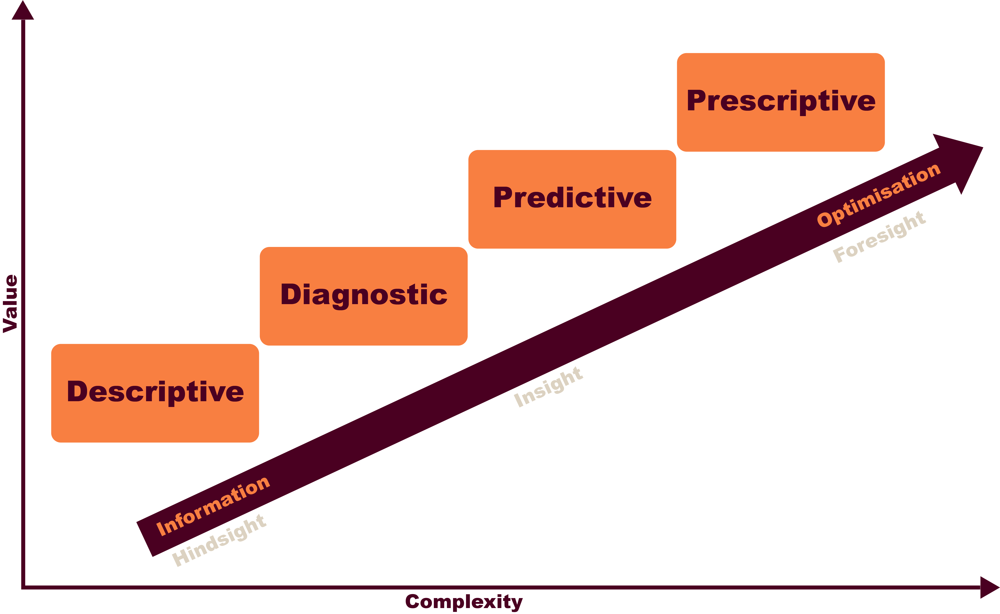
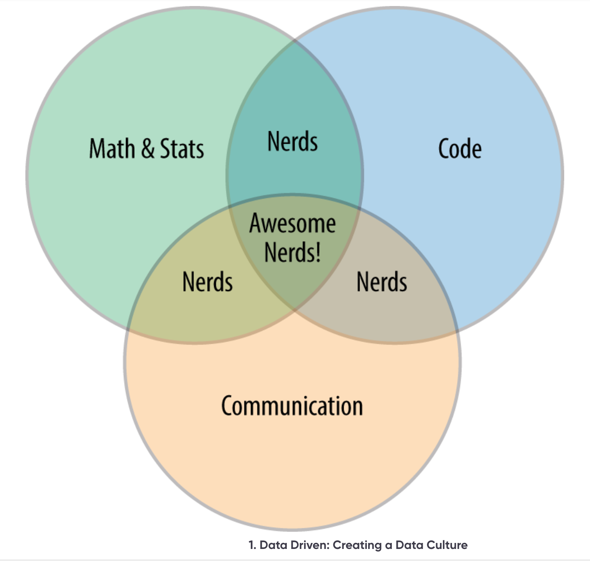
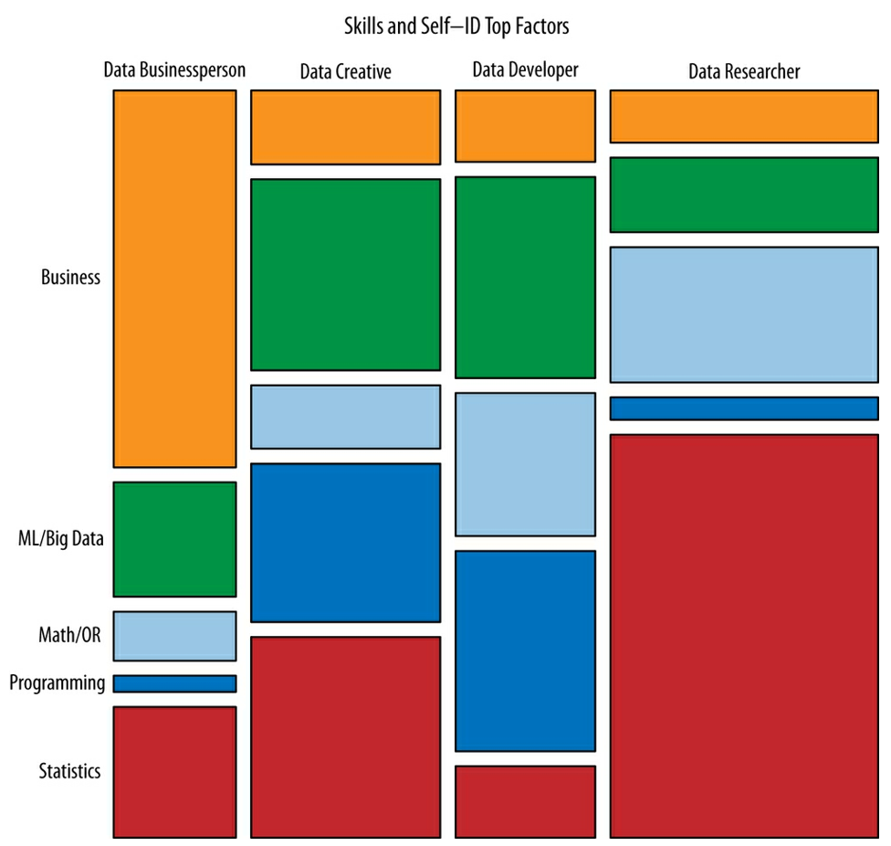

# Introduction

> “Data! data! data!” he cried impatiently. “I can’t make bricks without clay.”

@doyleAdventureCopperBeeches1986 [p4]

## What is data?

> Data has two main limitations as a source of such knowledge. First, it is
> almost always an imperfect measure of what we are really interested in: asking
> how happy people were last week on a scale from zero to ten hardly
> encapsulates the emotional wellbeing of the nation. Second, anything we choose
> to measure will differ from place to place, from person to person, from time
> to time, and the problem is to extract meaningful insights from all this
> apparently random variability.

@spiegelhalterArtStatisticsLearning2019 [p10]

Data Science is the study of data to find insights and trends. It is a
multidisciplinary field that uses techniques from statistics, machine learning,
and computer science to analyse and interpret complex data. Data visualisation
is the process of presenting data in a visual format, such as charts, graphs,
and maps, to help people understand the data and make informed decisions.

In this course we will explore the key concepts and techniques of data science
and data visualisation, and learn how to apply them to real-world problems. We
will cover topics such as data cleaning, data wrangling, data analysis, and data
visualisation. The course purposefully doesn't focus on specific tools or
programming languages, but rather on the underlying concepts and techniques that
are common to all data science and data visualisation projects. As a data
scientist, you may not have free-choice of tools, so it is important to
understand the underlying principles and techniques that are common to all data
science projects.

---

## Activity 1.1.1

_Allow 15 minutes_

In the course forum, describe what you think data science is. What do you think
a data scientist does? What tools do you think a data scientist uses?

At this point, you may not have a clear idea of what data science is, and that's
okay! We will explore the key concepts and techniques of data science in this
course.

---

As you look through the posts in the course forum, you may notice that there are

## Activity 1.1.2

_Allow 15 minutes_

Watch the video
[Data Science in Five Minutes](https://www.youtube.com/watch?v=X3paOmcrTjQ)

Is there anything in the video that surprised you? What did you learn from the
video?

---

## What Is Data Science?

Data Science is an essential part tool in the modern economy. It underpins the
AI revolution and is used in a wide range of industries, from finance to
healthcare to marketing. Data Science underpins our ability to:

1. Understand our customers better
2. Make informed decisions
3. develop new products and services

You can find Data Science being employed across a wide range of industries. Some
examples include:

### Retail

- _Personalized Marketing_: Retailers like Amazon and Netflix use data science
  to understand customer preferences, leading to tailored recommendations and
  increased sales.
- _Inventory Management_: By analysing sales data and predicting demand,
  retailers can optimize inventory levels, reducing costs and preventing
  "stockouts".
- _Price Optimization_: Dynamic pricing based on demand and competitor analysis
  can significantly boost revenue.
- Customer segmentation, churn prediction, and marketing campaign optimization
  can improve ROI and customer satisfaction.

### Financial

- _Fraud Detection_: Banks employ data science to identify fraudulent
  transactions, protecting their assets and customer trust.
- _Risk Assessment_: Credit scoring models help financial institutions assess
  loan risk, leading to better lending decisions and reduced defaults.
- _Algorithmic Trading_: High-frequency trading firms use complex algorithms to
  make rapid trading decisions based on market data, generating substantial
  profits.

### Manufacturing

- _Supply Chain Optimization_: Data-driven insights can optimize supply chains,
  reducing costs and improving efficiency.
- _Predictive Maintenance_: By analysing equipment data, manufacturers can
  predict failures, schedule maintenance proactively, and avoid costly downtime.
- _Quality Control_: Data-driven quality control systems can identify defects
  early in the production process, reducing waste and improving product quality.

### Healthcare

- _Drug Discovery_: Data science accelerates drug discovery by analysing vast
  amounts of biological data to identify potential drug targets.
- _Precision Medicine_: Personalized treatment plans based on patient data can
  improve treatment outcomes and reduce healthcare costs.
- _Fraud Detection_: Detecting fraudulent claims in healthcare insurance is
  crucial for maintaining profitability.

### Other Industries

- _Transportation and Logistics_: Optimizing routes, predicting demand, and
  managing fleets efficiently can lead to significant cost savings.
- _Energy_: Data-driven energy management can optimize energy consumption,
  reduce costs, and increase efficiency.
- _IT_: Monitoring system performance, predicting failures, threat vectors, and
  optimizing resource allocation can improve system reliability and reduce
  downtime.

Though you may associate Data Science with big tech companies or finance, it is
increasingly essential to a broad range of industries. Universities will use
data science to track and understand student performance to improve teaching and
support. Healthcare providers use data science to improve patient outcomes.
Governments use data science to improve public services. Data science is
_everywhere_.

---

## Activity 1.1.3

_Allow 1 hour_

Using the library search engine, find a recent article on how data science is
being used in a specific industry. Summarize the article and consider the
following questions:

- What are the key takeaways from the article?
- What value did data science yield?
- What (software) tools are being used in the industry?
- What are the challenges faced by the industry?

Post your summary, a link to the article, and answers to the questions in the
course forum.

---

In your research, you may have noticed that some terms are used interchangeably
when discussing data science. For example, you may have seen the terms "data
science" and "business intelligence" used to describe similar concepts. Whilst
there is some overlap between these terms, they are not the same thing. Data
Science is a broader field that encompasses a wide range of techniques and tools
for analysing and interpreting data. Business Intelligence, on the other hand,
is a subset of data science that focuses on using data to make informed business
decisions. Business Intelligence is often used to analyse historical data and
generate reports and dashboards that help businesses understand their
performance and make informed decisions. Data Science, on the other hand, is a
more general term that encompasses a wide range of techniques and tools for
analysing and interpreting data. Data Science is often used to develop
predictive models that help businesses forecast future trends and make informed
decisions. Data Science is a rapidly evolving field, and new techniques and
tools are being developed all the time. Whilst there is some overlap between
Data Science and Business Intelligence, they are not the same thing, and it is
important to understand the differences between them.

---

## Activity 1.1.4

_Allow 30 minutes_

Read the article
[Data Science: What is it and how can it help your business?](https://www.ibm.com/topics/data-science)

This article retreads some of the same ground as the previous section, but
starts to explain the difference between some therms that are often used
interchangeably. Consider the following questions:

- What is the difference between Data Science and Business Intelligence?
- What is the difference between Data Science and a Data Scientist?

---

## Types of Data Science

Data Science can be divided into four main areas. These areas are not mutually
exclusive, and many data scientists will work across multiple areas.

### Descriptive Analytics

Descriptive analytics uses data to describe answers the question "what
happened?". For example, a company might use descriptive analytics to analyse
sales data to understand trends and patterns. Descriptive analytics is often the
first step in any data analysis project. The common deliverables are reports,
dashboards, and visualisations. Descriptive analytics can also be used to
develop more sophisticated products such as interactive dashboards using
technologies like Tableau. Users access a web-based interface from which they
are guided through their data of interest. Visuals and tables will display the
most relevant aspects of the business, while filters, selectors, and buttons
offer users the possibility to customize their journey through data, drilling
down into the aspects they are mostly intrigued by. You'll try your hand at
descriptive analytics later in this week.

### Diagnostic Analytics

Diagnostic analytics uses data to understand _why_ something happened. For
example, a company might use diagnostic analytics to analyse customer feedback
to understand why sales have dropped. You'll try your hand at diagnostic
analytics later in this course.

### Predictive Analytics

Predictive analytics uses historical data to predict _how_ likely something is
to happen in the future. For example, a company might use predictive analytics
to forecast sales or customer churn. The simplest examples of predictive
analytics are diagnostic tools: they enrich the more traditional descriptive
reports with a model-based inference of possible causes behind what we see in
data. By using basic methods like correlation analysis, control charting, and
tests of statistical significance, these tools can highlight interesting
patterns, shedding light on the reasons why the business is going in a certain
way. These can be built on by developing business alerts; diagnostic checks are
carried out automatically and users get notified when some situation of business
interest, such as vulnerability reporting in a security system, is detected.
Another form of predictive analytics expert systems, which are rule-based
models. You can find these in services like Netflix, which use them to recommend
movies to users based on their past preferences.

### Prescriptive Analytics

Prescriptive analytics uses data to recommend actions to achieve a desired
outcome. For example, a company might use prescriptive analytics to optimise its
supply chain or marketing strategy. These are the most advanced forms of
analytics, and require the most sophisticated models. They are often used in
complex systems such as share-trading algorithms that buy and sell stocks based
on market conditions without human intervention.

With all of these types of analytics the goal is to use data to understand
situations. Although Predictive and Prescriptive analytics may require a greater
depth of understanding of the data and the business, all of these types of
analytics are built on the same foundation of data. It is essential to get this
foundation right before moving on to more complex types of analytics.

> Foresight isn’t a mysterious gift bestowed at birth. It is the product of
> particular ways of thinking, of gathering information, of updating beliefs.
> These habits of thought can be learned and cultivated by any intelligent,
> thoughtful, determined person.

@tetlockSuperforecastingArtScience2015 [p8]

## What is a Data Scientist?

Alongside this determination and technical ability, a data scientist also needs
strong communication skills. Being "good at data" is not enough, _the medium is
not the message_. The best data scientists are able to communicate their
findings clearly and effectively, work with stakeholders to understand their
needs, and develop solutions that meet those needs. According to
@davenportDataScientistSexiest2012 the traditional route into data science was
through a deep understanding of statistics; the job was dominated by people with
PhDs in theoretical physics or statistics. However, the field has evolved, and
data scientists now come from a wide range of backgrounds, including computer
science, engineering, and social sciences. The key skills of a data scientist
are:

- **Technical skills**: Data scientists need to be proficient in programming
  languages such as Python or R, and have a good understanding of statistics and
  machine learning algorithms.
- **Mathematical skills**: Data scientists need to be able to analyse data and
  draw meaningful conclusions from it. Whilst software packages such as Excel,
  SPSS, R and Python can help, it is important to understand the underlying
  principles of statistics.
- **Communication skills**: Data scientists need to be able to communicate their
  findings to a non-technical audience. This might involve creating
  visualisations, writing reports, or giving presentations.

Whilst these are core skills for a data science, there are many other skills
that are useful. For example, data scientists need to be able to work with
stakeholders to understand their needs, and develop solutions that meet those
needs. They also need to be able to work with large datasets, and have a good
understanding of data wrangling and cleaning techniques. Data scientists also
need to be able to work with uncertainty, and be able to make decisions based on
incomplete or imperfect data. underpinning all of these skills is a curious
mind, and a willingness to experiment and learn new things. Data science is a
rapidly evolving field, and data scientists need to be able to adapt to new
technologies and techniques.

Image courtesy of @patilDataDriven2015 [p3]

Underlying all of these skills are some more specific skills that are essential
for all data scientists to possess. According to @harrisAnalyzingAnalyzers2013,
the best data scientists have "T shaped" skills. This means that they have a
broad range of skills across a wide range of areas, but also have a deep
understanding of one or two specific areas. For example as a Developer, you may
have a deep understanding of programming languages, but also need a grounding in
Maths, and Organisational Research. As a Business Intelligence, your deep
understanding may be in the business itself, with a shallower understanding of
the technical aspects of data science.

from @harrisAnalyzingAnalyzers2013 [p13]
