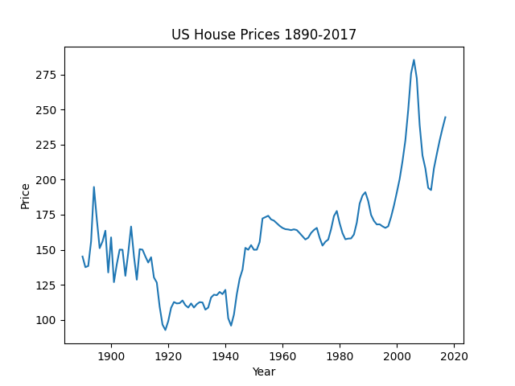
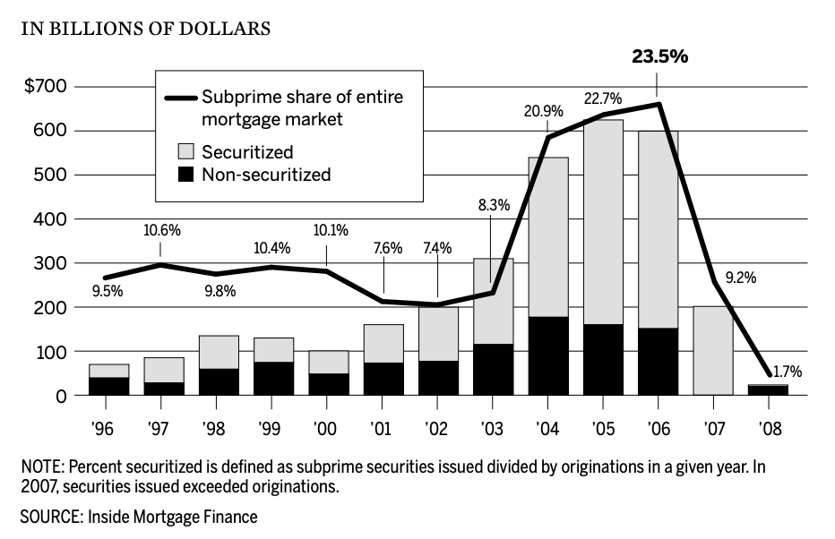

### Case Study: The Housing Market Crash of 2008

In 2008, the housing market crash triggered a global financial crisis that led
to the worst recession since the Great Depression. It has been depicted in films
such as The Big Short and Inside Job. This crash

This housing market crash wasn't caused by a single factor, but rather a
combination of interconnected issues:

#### Housing Bubble

Easy access to credit and low interest rates inflated housing prices beyond
their true value, creating a bubble. The American hosing market had
traditionally been stable. Nate Silver reports that

> "After adjusting for inflation a $10,000 investment in a home in 1896 would be
> worth just $10,600 in 1996. The rate of return had been less in a century than
> the stock market typically produces in a year."

@silverSignalNoiseArt2013 [p30]

You can see the relative US house prices in the graph below. Note the sharp
increase in house prices starting in 2003, and the subsequent crash in 2008.

## Activity 1.2.1: Recreate the above graph

_Allow 1 hour_

There is a simple dataset
[here](https://www.multpl.com/case-shiller-home-price-index-inflation-adjusted/table/by-month)
that you can use to recreate this graph. I've created an `csv` (Comma Separated
Values) file of the data in [activities](../Activities/1/1.2.1/houseprices.csv).
You can use Excel, Google Sheets, or any other tool you are comfortable with.

##### Discussion

See the recording for a discussion of how I created the graph. The notebook is
available [here](../Activities/1/1.2.1/1.2.1.ipynb).

#### Subprime Mortgages

Lenders offered risky loans to borrowers with poor credit history (subprime) at
adjustable interest rates. These borrowers struggled to afford payments when
rates went up. In the space of just three years, the share of the market for
subprime mortgages had grown from 8.3% of the market to 23.5% of the market.
This near-tripling of the market share meant that almost a quarter of mortgages
were at active risk of default.

Image courtesy of @thefinancialcrisisinquirycommissionFINANCIALCRISISINQUIRY2011
[p. 70]

## Activity 1.2.2 Extend your learning (Optional)

_Allow 1 hour_

There is an excellent, albeit very deep explanation of the subprime mortgage
crisis
[here](https://www.nber.org/system/files/working_papers/w14625/w14625.pdf).
Whilst the statistics are beyond the scope of this course, it will give a great
insight into the rigour of the analysis that data scientists and economists
undertake. While scanning the document, consider the following questions:

- Are the results reproducible?
- Are the methods clear?
- Are the data sources accessible?
- Do they suggest different causes of the crisis?

#### Mortgage-Backed Securities

One of the underlying reasons these risky mortgages were able to be offered was
the development of new financial products. Financial institutions such as Lehman
Brothers and Bear Stearns had developed new financial products that allowed them
to bundle these risky mortgages together and sell them as investments. These
Mortgage-Backed Securities (MBS) were sold to investors, spreading the risk but
also making it hard to assess the underlying quality of the loans. Each Mortgage
Backed Security is essentially a bet that the underlying mortgages will be
repaid. These bets were then bundled together and sold on to other investors.
This meant that the risk was spread across the financial system, but also meant
that it was hard to assess the underlying quality of the loans. Lehman Brothers
effectively bet thirty one times _on each mortgage_ being repaid
@lioudisCollapseLehmanBrothers2024. When the housing market crashed, the value
of these Mortgage Backed Securities plummeted, and financial institutions
buckled under the weight of bad debt. This triggered a domino effect that led to
the global financial crisis.

#### Predatory Lending

These MBS were a primary contributing factor to the increase in predatory
lending practices. Loan providers knew that they could sell on the risk, so they
were less concerned about the underlying quality of the loans. Alongside this,
mortgage brokers were incentivised to sell as many loans as possible, as they
received a commission for each loan they sold. Unethical lending practices
included misleading borrowers about loan terms and inflating their income to
qualify for loans. This meant that they could offer loans to people who were
unlikely to be able to repay them. This also had the effect of accelerating the
housing bubble; borrowers who were previously unable to afford properties were
now able to buy them, which in turn accelerated the rise in house prices.

#### Lax Regulation

Underlying all of these issues was a lack of regulation. The US government had
deregulated the financial sector in the 1980s and 1990s, which allowed financial
institutions to take on more risk. The government also failed to regulate the
mortgage industry, which allowed predatory lending practices to flourish. The
government also failed to regulate the financial products that were being
developed, which allowed the creation of complex financial products that were
difficult to understand and assess. Compounding this was the fact that salaries
at credit agencies were a third of those at investment banks, meaning that the
best talent ended up working for the banks, rather than the credit agencies. The
gamekeeper was effectively working for the poacher.

These factors all came together to create a ticking time bomb. When the housing
bubble burst, homeowners defaulted on their mortgages, the value of MBS
plummeted, and financial institutions buckled under the weight of bad debt. This
triggered a domino effect that led to the global financial crisis.

#### Could Data Science Have Prevented the 2008 Financial Crisis?

The underlying causes of the 2008 financial crisis were complex, and it was only
after the fact that the pieces of the puzzle came together.

<!--TODO: add examples-->

Despite the complexity of the contributing factors and the hidden risks, data
science could have helped identify the warning signs of the impending crisis.
Here's how:

#### Activity 1.2.3: Library Search

_Allow 1 hour_

Use the library search to find out more about the housing crisis. You could
start with the following search terms:

- Housing crisis 2008
- Subprime mortgages
- Mortgage-backed securities
- Predatory lending
- Lax regulation

Remember to use the PROMPT criteria to evaluate the sources you find. Whilst the
library search is curated; it will still contain a range of sources, some of
whom will have a less objective stance than others. A simple way of judging the
importance of the source is to look at the number of times it has been cited.
This is a good indicator of the importance of the source in the field.

While reviewing papers, consider the following questions:

- Are the results reproducible?
- Does the hypothesis make sense?
- Are the methods clear?
- Do the results support the hypothesis?
