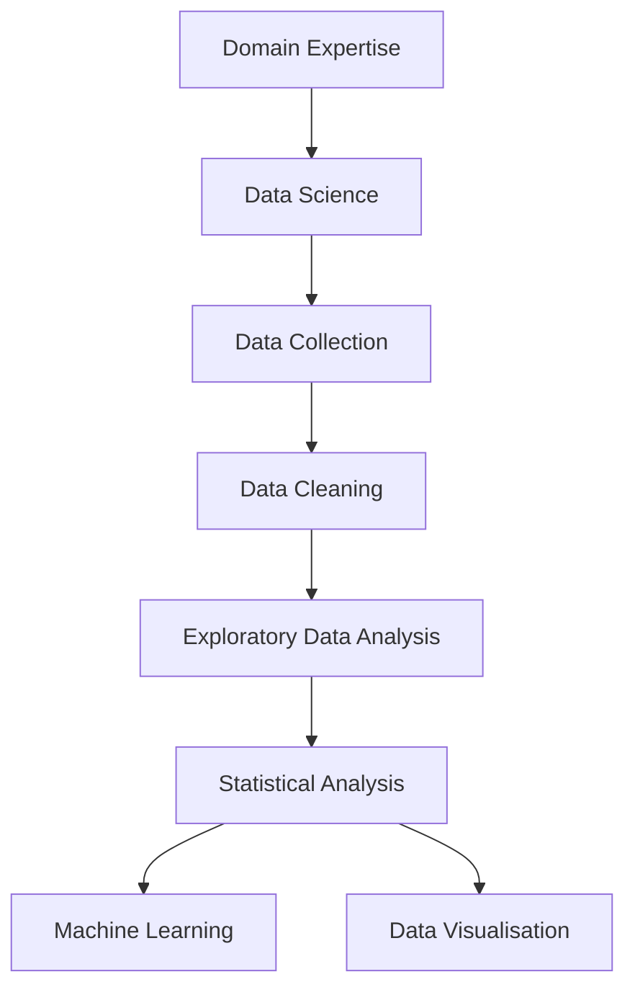

# The Building Blocks of Data Science

In Section 1.1, we discussed the key attributes of a data scientist. In this
section, we will explore the types of data analysis that data scientists use to
extract insights from data.

Data science is a multidisciplinary field that combines domain, statistical, and
computational expertise to extract insights from data. Data scientists use a
variety of tools and techniques to analyse data, including statistical analysis,
machine learning, and data visualisation. Let's see how these pieces fit
together.

## Domain Expertise

Domain expertise refers to the knowledge and expertise that data scientists have
in a specific field or industry. Domain expertise is essential for data
scientists to understand the data they are analysing and to extract meaningful
insights from it. Data scientists with domain expertise can ask the right
questions, identify relevant patterns and trends, and communicate their findings
to stakeholders. Working in areas where you do not have this domain experience
is a challenge, but it is possible to learn the domain knowledge as you go. The
key is to be curious and ask questions. The data can provide answers, but to be
able to make judgements on the data, you need to understand the context in which
it was collected. In these cases, knowing _who to ask_ can be just as important
as knowing _what to ask_.

## Data Collection

Data collection is the process of gathering data from various sources, such as
databases, open-source datasets, and experiments. Data collection is a critical
step in data analysis, as the quality of the data will determine the accuracy
and reliability of the analysis. Data scientists can be involved in all stages
of the data collection process, from engineering data collection, storage, and
cleansing processes, right through to consuming the data for analysis. Data
engineering is somewhat outside the scope of this course, but we will look at
some of the key concepts in week [2](../02/2.0.md). For the explicit data
collection techniques, we will look at traditional data sources, such as
databases, as well as web-based techniques such as web APIs and web scraping.
This will be discussed in week [3](../03/3.0.md). We will also look at wrangling
multiple sources into a single dataset, and how to handle different data types.

## Data Cleaning

Data cleaning is the process of removing errors, duplicates, and missing values
from the data. Data cleaning is essential for data analysis. Dirty data will
lead to inaccurate results and misleading conclusions. A key tool in the data
sceintist's toolbox is the ability to clean data. This must be done ina way that
does not introduce bias or skew the results. Data scientists use a variety of
techniques to clean data, including data imputation, outlier detection, and data
transformation. We'll discuss this in week [4](../04/4.0.md).

## Statistical Analysis

Statistical analysis is the process of collecting, cleaning, analysing, and
interpreting data to uncover patterns and trends. Statistical analysis is used
to summarise data, test hypotheses, and make predictions. It is a fundamental
tool in data science, and data scientists use statistical techniques to extract
insights from data.

Statistical analysis is a powerful tool for extracting insights from data, and
data scientists use statistical techniques to uncover patterns and trends in the
data. This course is not a statistics course, but we will cover some of the key
statistical techniques that data scientists use to analyse data, using both
Python and R. This will be discussed in week [6](../05/5.0.md).

## Machine Learning

Machine Learning or ML is not a topic of this course, but it's useful to
understand what it is, and how it relates to data science. Machine learning is a
specific field of AI of artificial intelligence that involves building
algorithms that can learn from data and make predictions. Machine learning
algorithms can be used to analyse data, identify patterns, and make decisions
without being explicitly programmed. For our purposes, we can see this as the
next logical step after statistical analysis. Once we have identified patterns
and trends in the data, we can develop new or leverage existing machine learning
algorithms to make predictions and automate decision-making.

## Exploratory Data Analysis

Exploratory Data Analysis or EDA is the process of analysing data to summarise
its main characteristics, often with visual methods. EDA is a critical step in
data analysis, as it helps data scientists understand the data, identify
patterns and trends, and generate hypotheses. EDA is an iterative process, and
data scientists use a variety of techniques to explore the data, including
descriptive statistics, data visualisation, and hypothesis testing. We will
cover this in week [6](../06/4.0.md).

## Data Visualisation

Data visualisation is the process of representing data graphically to help
people understand the data and make informed decisions. Data visualisation is a
key tool in data science, and data scientists use visualisation techniques to
explore data, identify patterns, and communicate their findings to stakeholders.
We can use visualisation to both explore the data, and to communicate our
findings to stakeholders. We will cover some of the key data visualisation
techniques that data scientists use to visualise data, using both Python and R.
This will de discussed in weeks [7](../07/7.0.md), and [8](../08/8.0.md).
