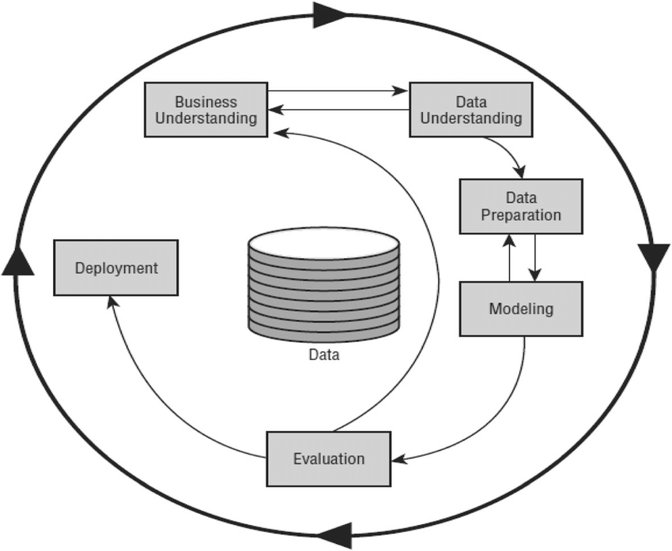

# Beginning Your Research

Alongside sourcing data, we should consider a framework for conducting your research. This will help you to stay focused and ensure that you are gathering the right information, performing the right analysis, and drawing the right conclusions. 

## PPDAC

One such framework is the PPDAC framework. PPDAC stands for Problem, Plan, Data, Analysis, and Conclusion. This framework is commonly used in data science to guide the research process. 
Image courtesy of  @gaoStatisticsMachineLearning2022

- **Problem**: Define the problem you are trying to solve. What are the key questions you are trying to answer? What are the goals of your analysis?
- **Plan**: Develop a plan for how you will conduct your research. What data sources will you use? What methods will you use to analyse the data? What tools will you use to visualise the data?
- **Data**: Collect and clean the data. Ensure that the data you are using is accurate, complete, and relevant to the problem you are trying to solve.
- **Analysis**: Analyse the data using the methods you have chosen. Look for patterns, trends, and relationships in the data.
- **Conclusion**: Draw conclusions based on your analysis. What insights have you gained from the data? What recommendations can you make based on your findings?

Though basic, the PPDAC framework provides a useful structure for conducting research. It helps to ensure that you are following a logical process and that you are considering all aspects of your research.

### Activity 2.3.1

#### What are the limitations of the PPDAC framework? (10 min)

#### Discussion

Whilst I like the PPDAC framework for its simplicity, it conflates the conclusion with *Communication*. It is important to communicate your findings to others in a meaningful way. We will see later on in this course the importance of visualisation and storytelling in data science.

## CRISP-DM

Another popular framework for conducting research is the CRISP-DM framework. CRISP-DM stands for Cross-Industry Standard Process for Data Mining. The CRISP-DM framework is a more detailed and comprehensive framework than the PPDAC framework.

Image courtesy @chapmanCRISPDMStepbystepData2000

- **Business Understanding**: Understand the business problem you are trying to solve. What are the goals of your analysis? What are the key questions you are trying to answer?
- **Data Understanding**: Collect and explore the data. What data sources are available? What data do you need to answer your key questions?
- **Data Preparation**: Clean and prepare the data for analysis. Ensure that the data is accurate, complete, and relevant to the problem you are trying to solve.
- **Modeling**: Build and evaluate models to answer your key questions. What methods will you use to analyse the data? What tools will you use to visualise the data?
- **Evaluation**: Evaluate the models you have built. Are they accurate and reliable? Do they answer your key questions?
- **Deployment**: Deploy the models you have built. Communicate your findings to others in a meaningful way. What recommendations can you make based on your findings?

The CRISP-DM framework is more detailed and comprehensive than the PPDAC framework. It provides a more structured approach to conducting research and ensures that you are considering all aspects of your research.

### Activity 2.3.2

Find and read this systematic review of the use of the CRISP-DM framework in data science research. 

https://doi.org/10.1016/j.procs.2021.01.199

