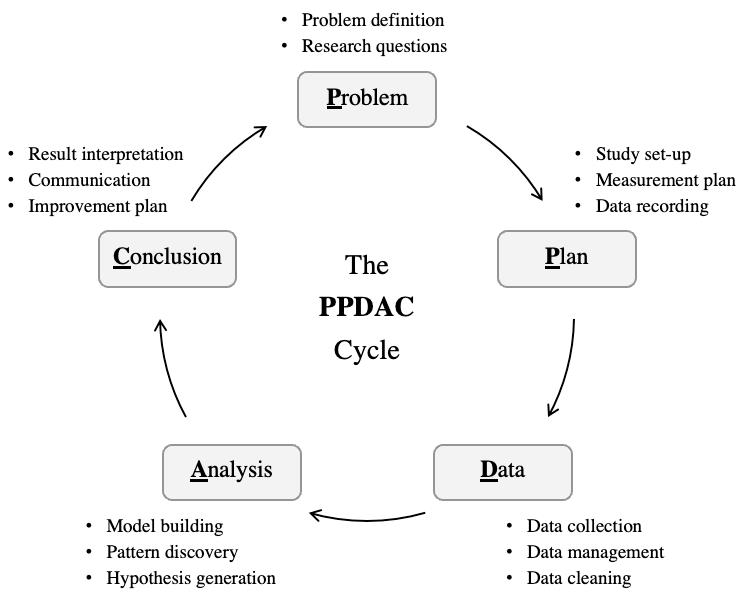
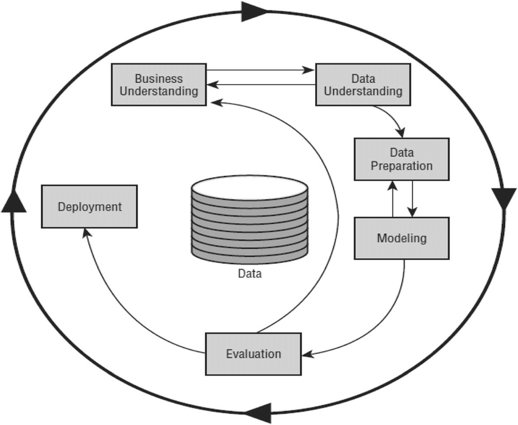

# Beginning Your Research

Alongside sourcing data, we should consider a framework for conducting your
research. This will help you to stay focused and ensure that you are gathering
the right information, performing the right analysis, and drawing the right
conclusions.

## PPDAC

One such framework is the PPDAC framework. PPDAC stands for Problem, Plan, Data,
Analysis, and Conclusion. This framework is commonly used in data science to
guide the research process. PPDAC is commonly used in teaching statistics to
Secondary School students. It is a simple and effective way of teaching the
scientific method.

_Image courtesy of_ @gaoStatisticsMachineLearning2022

- **Problem**: Define the problem you are trying to solve. What are the key
  questions you are trying to answer? What are the goals of your analysis?
- **Plan**: Develop a plan for how you will conduct your research. What data
  sources will you use? What methods will you use to analyse the data? What
  tools will you use to visualise the data?
- **Data**: Collect and clean the data. Ensure that the data you are using is
  accurate, complete, and relevant to the problem you are trying to solve.
- **Analysis**: Analyse the data using the methods you have chosen. Look for
  patterns, trends, and relationships in the data.
- **Conclusion**: Draw conclusions based on your analysis. What insights have
  you gained from the data? What recommendations can you make based on your
  findings?

Though basic, the PPDAC framework provides a useful structure for conducting
research. It helps to ensure that you are following a logical process and that
you are considering all aspects of your research. PPDAC is notable for being
both being simple and iterative; the conclusion can, lead to further problem
solving and data collection.

### Activity 2.3.1

_Allow 45 minutes_

Try to consider how you might apply the PPDAC framework to your project. What
limitations do you think you might encounter? How might you overcome these?

#### Discussion

PPDAC's strength is in its simplicity. This explains its popularity in teaching
statistics to secondary school students. This simplicity, however risks
oversimplifying the research process. As data scientists, a good proportion of
our time is spent on data cleaning and preparation. This is not explicitly
included in the PPDAC framework. Similarly, PPDAC risks conflating the
_Conclusion_ with _Communication_. Whilst some authors
[@gaoStatisticsMachineLearning2022, @spiegelhalterArtStatisticsLearning2019,
@birkCommunicatingDataExploration2022] seek to expand the conclusion stage to
explicitly include communication, the framework itself does not include an
explicit step for this. We will see later on in this course the importance of
visualisation and storytelling in data science.

## CRISP-DM

An alternative framework for conducting research is the CRISP-DM framework.
CRISP-DM stands for _Cross-Industry Standard Process for Data Mining_. Since
it's creation in 2000, the CRISP-DM framework has become the most popular The
CRISP-DM framework is a more detailed and comprehensive framework than the PPDAC
framework.

Image courtesy @chapmanCRISPDMStepbystepData2000

The elements of CRISP-DM are are _largely_ sequential, but are iterative and can
be revisited as needed. The steps in the CRISP-DM framework are:

- **Business Understanding**: Understand the business problem you are trying to
  solve. What are the goals of your analysis? What are the key questions you are
  trying to answer? This element is key to the CRISP-DM framework, as it
  progressively refines the business understanding as throughout the analysis.
- **Data Understanding**: Collect and explore the data. What data sources are
  available? What data do you need to answer your key questions?
- **Data Preparation**: Clean and prepare the data for analysis. Ensure that the
  data is accurate, complete, and relevant to the problem you are trying to
  solve.
- **Modelling**: Build and evaluate models to answer your key questions. What
  methods will you use to analyse the data? What tools will you use to visualise
  the data?
- **Evaluation**: Evaluate the models you have built. Are they accurate and
  reliable? Do they answer your key questions?
- **Deployment**: Deploy the models you have built. Communicate your findings to
  others in a meaningful way. What recommendations can you make based on your
  findings?

The CRISP-DM framework is more detailed and comprehensive than the PPDAC
framework. It provides a more structured approach to conducting research and
ensures that you are considering all aspects of your research.

## Activity 2.3.2

_Allow 45 minutes_

Find and read the article "A Systematic Literature Review on Applying CRISP-DM
Process Model" by Schröer et al. (2021). The article is available online at via
<https://doi.org/10.1016/j.procs.2021.01.199>

While reading, consider the following questions:

- How might you apply CRISP-DM to your project?
- What are the strengths and weaknesses of the framework?
- Would you consider using it in your research?

### Discussion

CRISP-DM's strength is that it is platform agnostic, this means it can be
applied to small-scale projects using open-source tools or large-scale projects
using proprietary software. The table presented in the paper provides a useful
breakdown of how the framework may be applied to different stages of the
research process. The paper also highlights the importance of the _Business
Understanding_ For me, this is the most important stage of the CRISP-DM
framework. It ensures that the research is focused on the key questions and
goals of the analysis. This continued focus may be difficult to manage in
practice, as the research process is often iterative and may require revisiting
earlier stages of the framework. You may find that returning to business
understanding opens the research to "scope creep". This is where the research
expands beyond the original goals of the analysis. This can be a good thing, but
it can also lead to a loss of focus and direction, so needs careful management.

# SEMMA

SEMMA is another popular framework for conducting research. SEMMA was developed
by the SAS Institute as a way of using their proprietary software. SEMMA stands
for Sample, Explore, Modify, Model, and Assess. The SEMMA framework is commonly
used in data mining to guide the research process, as such it is more focused on
the data analysis process than the PPDAC and CRISP-DM frameworks.

The phases of the SEMMA framework are as follows:

- **Sample**: Take a sample of the data you are working with. This will help you
  to understand the data and identify any potential issues. The sample should be
  large enough to be representational, but small enough to be manageable. This
  step is optional, but can be a useful way of assessing data quality before
  attempting the subsequent steps.
- **Explore**: Explore the data to identify patterns, trends, and relationships.
  Look for outliers and missing values in the data.
- **Modify**: Modify the data to prepare it for analysis. Clean the data and
  ensure that it is accurate, complete, and relevant to the problem you are
  trying to solve.
- **Model**: Build and evaluate models to answer your key questions. What
  methods will you use to analyse the data? What tools will you use to visualise
  the data?
- **Assess**: Assess the models you have built. Are they accurate and reliable?
  Do they answer your key questions?

## Activity 2.3.3

_Allow 45 minutes_

Looking at the steps in the SEMMA framework, is there anything missing?

### Discussion

The focus on the data analysis process in the SEMMA framework is both a strength
and a weakness. Whilst it provides a clear structure for conducting research, it
does not provide guidance on how to communicate your findings to others. As we
will see later on in this course, communication is a crucial aspect of data
science.

## KDD

KDD stands for Knowledge Discovery in Databases. KDD is the oldest framework
presented here, dating back to the 1996. Despite its age, it is still widely
used in data mining to guide the research process. Like SEMMA and PPDAC, KDD is
a five step process. The steps in the KDD framework are as follows:

- **Selection**: Select the data you are working with. This will help you to
  understand the data and identify any potential issues.
- **Preprocessing**: Preprocess the data to prepare it for analysis. Clean the
  data and ensure that it is accurate, complete, and relevant to the problem you
  are trying to solve.
- **Transformation**: Transform the data to prepare it for analysis. Look for
  patterns, trends, and relationships in the data.
- **Data Mining**: Mine the data to identify patterns, trends, and
  relationships. Look for outliers and missing values in the data.
- **Interpretation/Evaluation**: Interpret the data you have mined. What
  insights have you gained from the data? What recommendations can you make
  based on your findings?

Unlike PPDAC and CRISP-DM, KDD is a sequential process without the iterative
loops of the other frameworks. This can be both a strength and a weakness. On
the one hand, it provides a clear structure for conducting research. On the
other hand, it does not allow for the flexibility and adaptability of the other
frameworks. This rigidity may avoid the risk of scope creep, but it may also
limit the potential insights that can be gained from the data. Worse, you may
find that the data does not match the problem you are trying to solve, leading
to a dead end in your research.

<!-- TODO: Add more activities -->
