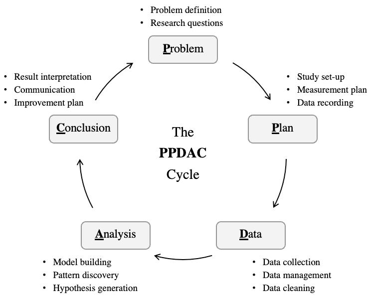

# Beginning Your Research

Alongside sourcing data, we should consider a framework for conducting your research. This will help you to stay focused and ensure that you are gathering the right information, performing the right analysis, and drawing the right conclusions. 

## PPDAC

One such framework is the PPDAC framework. PPDAC stands for Problem, Plan, Data, Analysis, and Conclusion. This framework is commonly used in data science to guide the research process.
PPDAC is commonly used in teaching statistics to Secondary School students. It is a simple and effective way of teaching the scientific method.
 
Image courtesy of  @gaoStatisticsMachineLearning2022

- **Problem**: Define the problem you are trying to solve. What are the key questions you are trying to answer? What are the goals of your analysis?
- **Plan**: Develop a plan for how you will conduct your research. What data sources will you use? What methods will you use to analyse the data? What tools will you use to visualise the data?
- **Data**: Collect and clean the data. Ensure that the data you are using is accurate, complete, and relevant to the problem you are trying to solve.
- **Analysis**: Analyse the data using the methods you have chosen. Look for patterns, trends, and relationships in the data.
- **Conclusion**: Draw conclusions based on your analysis. What insights have you gained from the data? What recommendations can you make based on your findings?

Though basic, the PPDAC framework provides a useful structure for conducting research. It helps to ensure that you are following a logical process and that you are considering all aspects of your research.  PPDAC is notable for being both being simple and iterative; the conclusion can, lead to further problem solving and data collection.

### Activity 2.3.1

#### What are the limitations of the PPDAC framework? 