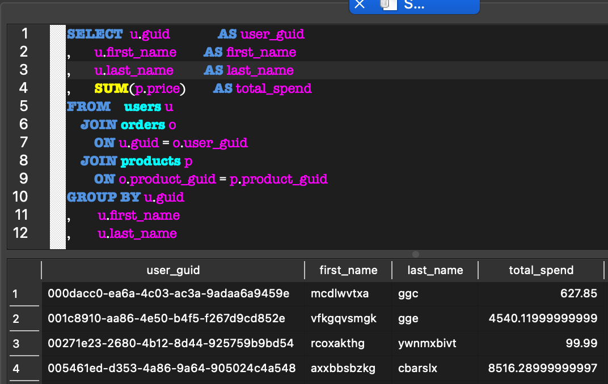

# 3.1: Databases

As a data scientist, you will often need to work with databases to extract,
transform and load data. In this section, we will introduce you to the basics of
databases and show you how to work with them using SQL.

A database is a collection of data that is stored in a computer system.
Databases allow data to be easily accessed, managed, and updated. Databases are
used in a wide range of applications, from simple contact lists to complex
financial systems.

Databases come in many different forms, but the most common type is a relational
database. In a relational database, data is highly structured, and stored in tables, which are made up
of rows and columns. Each row in a table represents a single record, while each
column represents a different attribute of the record. For example, a table of
customers might have columns for `name`, `address`, and `phone number`.

Relational databases are queried using a language called SQL
(Structured Query Language). Even if you are using a programming language such as Python to query or update a database, SQL will be involved at some point. SQL is a powerful language that allows you to
query, update, and manage data in a database. There are many _dialects_ of SQL
but the basic syntax is common across all of them; selecting data from a table
will look the same in SQLite as it does in MySQL, for example. The dialects
however have differences in the advanced features they support, and the way
they handle certain types of data. These more advanced features make dialects
much closer to a fully featured programming language than the basic SQL syntax.  For instance, Oracle's PL/SQL dialect is a fully featured programming language that can be used to create complex stored procedures and triggers.  It can act as a webserver, manage certificates, and even send emails. 

| Flavour       | Description                                                                            | SQL Dialect |
| ------------- | -------------------------------------------------------------------------------------- | ----------- |
| SQLite        | A lightweight, serverless, self-contained, and zero-configuration SQL database engine. | SQLite      |
| MySQL/MariaDB | An open-source relational database management system.                                  | MySQL       |
| PostgreSQL    | An open-source object-relational database system.                                      | PostgreSQL  |
| Oracle        | A commercial relational database management system.                                    | PL/SQL      |
| SQL Server    | A commercial relational database management system from Microsoft                      | T-SQL       |

Despite these dialects, all relational databases share the same concepts and
core functionality. In this section, we will focus on SQLite, a lightweight,
serverless, self-contained, and zero-configuration SQL database engine. SQLite
is arguably the most widely deployed SQL database engine in the world. It is
used in a wide range of applications, from mobile apps to web browsers.

## Relational Database Concepts

Though these concepts are not necessarily ones that you need to consider every
time you interact with a database, they are useful to know about. They will help
you understand how databases work, and why they are designed the way they are.
This will help you to write more efficient queries, and to understand why some
queries are slow.

### ACID

Relational databases are `write optimised`, meaning that they are designed to be
efficient at writing data to disk. This is because they are designed to store
large amounts of data and to be able to write to that data quickly. Relational
databases are also `ACID` compliant, meaning that they support the following
properties:

- Atomicity: All changes to the database are made as a single unit of work. If
  any part of the transaction fails, the entire transaction is rolled back.
- Consistency: The database is always in a consistent state. This means that the
  database will always be in a valid state, even if a transaction fails.
- Isolation: Transactions are isolated from each other. This means that changes
  made by one transaction are not visible to other transactions until the
  transaction is complete.
- Durability: Changes made to the database are permanent. This means that once a
  transaction is committed, the changes are written to disk and cannot be
  undone.

## Normalisation

Normalisation is something that will have a large impact on your analysis work.
In simple terms, `normalisation` is the process of removing duplicated, or
redundant data from a database. This is done by breaking up the data into
smaller tables, and linking them together using keys. Consider the following
table:

| Name       | Address                                                | Phone Number | Email Address  | Date of Birth |
| ---------- | ------------------------------------------------------ | ------------ | -------------- | ------------- |
| John Smith | 1 Brownberrie Ln, Horsforth, Leeds, Yorkshire LS18 5HD | 01234 567890 | John@email.com | 01/01/1970    |
| Jane Doe   | 1 Brownberrie Ln, Horsforth, Leeds, Yorkshire LS18 5HD | 09876 543210 | Jane@doe.com   | 01/01/1970    |

If John gave us a second email address, we would have to either add a new column
to the table, and _update every row in the table_, or create a second row for
John. If we created a second record for Joh, how would we know which row to use?
A second problem with this would be due to the `atom`ic nature of database
transactions. If we were to update John's email address, no-one would be able to
alter John's name, address, or phone number until the transaction was complete.
This would be a problem if we were to have a large number of users, or if we
were to have a large number of updates to make.

To work around these issues, we can normalise the data. Normalisation is a
process of breaking up the data into smaller tables, and linking them together
using keys. Returning to our example, let's see how we might normalise the data
for emails:

#### Users Table

| id  | Name       | Address ID                                             | Phone Number | Date of Birth |
| --- | ---------- | ------------------------------------------------------ | ------------ | ------------- |
| 1   | John Smith | 1 Brownberrie Ln, Horsforth, Leeds, Yorkshire LS18 5HD | 01234 567890 | 01/01/1970    |
| 2   | Jane Doe   | 1 Brownberrie Ln, Horsforth, Leeds, Yorkshire LS18 5HD | 09876 543210 | 01/01/1970    |

#### Emails Table

| id  | User ID | Email Address  |
| --- | ------- | -------------- |
| a   | 1       | John@email.com |
| b   | 2       | Jane@doe.com   |

In this example, we have split the data into two tables: `users` and `emails`.
If we want to look up John's email address, we can do so by joining the two
tables together. Repeating this process for other data types will allow us to
create a more efficient database.

#### Users Table

| id  | Name       | Date of Birth |
| --- | ---------- | ------------- |
| 1   | John Smith | 01/01/1970    |
| 2   | Jane Doe   | 01/01/1970    |

#### Addresses Table

| id  | User ID | Address                                                |
| --- | ------- | ------------------------------------------------------ |
| a1  | 1       | 1 Brownberrie Ln, Horsforth, Leeds, Yorkshire LS18 5HD |
| a2  | 2       | 1 Brownberrie Ln, Horsforth, Leeds, Yorkshire LS18 5HD |

#### Phone Numbers Table

| id  | User ID | Phone Number |
| --- | ------- | ------------ |
| p1  | 1       | 01234 567890 |
| p2  | 2       | 09876 543210 |

#### Emails Table

| id  | User ID | Email Address  |
| --- | ------- | -------------- |
| e1  | 1       | John@email.com |
| e2  | 2       | Jane@doe.com   |

This gets us closer to a normalised database. We can now update John's email
address without locking the rest of the data, and we can add as many email
addresses as we like. We can also add as many addresses and phone numbers as we
like. This is a much more flexible way of storing data.

Normalisation also considers whether data is aggregated. in our example there
are three examples of this. Firstly,we have the `Address` field. This is a
single field, but it is made up of four parts. We could normalise this by
splitting it into four fields: `Street`, `City`, `County`, and `Postal Code`.
This would allow us to query the data in a more granular way. Second, we store
the full name in a single column. If we wanted to find everyone with a surname
starting with `D`, we would have to search every row in the table. If we split
the name into two columns, we could index the surname column, and search that
instead. Finally, our phone number field is a single field, but it is made up of
two parts: the area code and the number. If we split this into two fields, we
could search for everyone in a particular area code, or everyone with a
particular number, we could even add an international dialling code, and search
for everyone in a particular country.

Our final normalised database could look like this:


This structure is much more flexible than our original structure. We can add as
many phone numbers, addresses, and email addresses as we like. We can also
update the data without locking the rest of the table. We can still find, we can
still return all of the information for a user, but our query would be slightly
more complex. We would have to join the tables together, and we would have to
use the `user_id` field to link the tables together. This is a small price to
pay for the flexibility that normalisation gives us.

Normalisation is an iterative process. You may find that you need to normalise
your data further as you work with it. This is normal, and is a sign that you
are getting to know your data better. You may also find that you need to
`denormalise` your data. Denormalisation is the process of combining tables back
together. This may be done to improve performance, or to simplify queries. It is
important to remember that denormalisation is a trade-off. You will lose some of
the flexibility that normalisation gives you, but you will gain performance. A
good rule of thumb is to only denormalise your data if you have a good reason to
do so. There are many ways to improve performance without the compromise of
changing the underlying data structure.

## Reading Entity Relationship Diagrams

In the previous sectionwe introduced a diagram to show how the tables were
related to one another. This diagram is called an `Entity Relationship Diagram`
(ERD). ERDs help us to visualise the relationships between entities in a
database. In our example, we have four entities: `users`, `addresses`,
`phone_numbers`, and `emails`. The lines between the entities show how they are
related. In our example, we have three relationships: `users` has `addresses`,
`users` has `phone_numbers`, and `users` has `emails`. We use "crow's foot"
notation to show the type of relationship. The `o{` symbol shows that the
relationship is `one-to-many`. This means that one user can have many addresses,
phone numbers, or email addresses. The `||` symbol shows that the relationship
is `one-to-one`. This means that one user can have only one name and date of
birth.

## Activity 3.1.1


_Allow 30 minutes_

How could we further normalise the data?
Looking at the Entity Relationship Diagram above, how could we further
normalised the data? What would the benefits of this be? What would the
drawbacks be?

#### Discussion

Our current design means we can only store a `first_name` and a `last_name`.
This means we are unable to consistently store middle names, or titles. We could
add two additional columns; `title`, and `middle_name`. Our address table has
assumes that addresses have a `street`, `city`, `county`, and `postal_code`.
There's two issues with this. Firstly, we are unable to tell which `country` an
address belongs in. Second, complex addresses may have a `building_name`,
`distict`, or `suburb`. If we were wanting to print an address, we may find it
difficult to know where to add line breaks. In both cases, the more edge-cases
we attempt to cater for, the more generic our naming should be. In addition to
adding new columns, we may consider a more generic naming structure of `line_1`,
`line_2`, `line_3`, `city`, `county`, `postal_code`, `country` to keep the names
relevant to the data they store.

## Activity 3.1.2

_Allow 30 minutes_

Install a sqlite3 database browser

The activities in this section will use a sqlite3 database. There are a number
of options for working with sqlite3 databases, including command line tools and
graphical user interfaces. Here are a few options:

| Tool                                                                                                    | Notes                                                | Installation                                                                                                                                                                     |
| ------------------------------------------------------------------------------------------------------- | ---------------------------------------------------- | -------------------------------------------------------------------------------------------------------------------------------------------------------------------------------- |
| [DB Browser for SQLite](https://sqlitebrowser.org/)                                                     | Simple and easy to use GUI for working with sqlite3  | `brew install --cask db-browser-for-sqlite` (MacOS) <br> `sudo apt install sqlitebrowser` (Debian & derivatives)<br> `winget install --id=sqlitebrowser.sqlitebrowser` (Windows) |
| [sqlite3](https://www.sqlite.org/index.html)                                                            | Command line tool for working with sqlite3 databases | `brew install sqlite` (MacOS) <br> `sudo apt install sqlite3` (Debian & derivatives) <br> `winget install --id=sqlite.sqlite` (Windows)                                          |
| [sqlite (VSCode extension)](https://marketplace.visualstudio.com/items?itemName=alexcvzz.vscode-sqlite) | VSCode extension for working with sqlite3 databases  | Install from VSCode marketplace                                                                                                                                                  |

If you are familiar with VSCode, the sqlite extension is a good option, though it is less fully-featured as the other options.  Whilst the command line
tool is powerful, it can be more difficult to use for beginners, and the interface can be a little unfriendly, particularly if you are trying to return a large number of rows and/or columns.
Our recommendation is to use DB Browser for SQLite. This is a robust, fully-featured DBMS (Database Management System) that is easy to use, and has a good balance of features and usability.
If you are
unable to install any of these tools, you can use the online tool
[SQLite Online](https://sqlite.org/fiddle/index.html).  You should be able to follow most of the activities using this tool, but you may find that some of the more advanced features are not available, or are more difficult to use.

## Database Objects

Before we get our hands dirty with SQL, let's take a look at some of the key
database objects that you will encounter when working with databases.

### Tables

A table is a collection of data that is organized into rows and columns. Each
row in a table represents a single record, while each column represents a
different attribute of the record. For example, a table of customers might have
columns for `name`, `address`, and `phone number`. Data is added altered or
removed in a table using DML commands. Alongside tables created by the user,
databases typically have system tables that store metadata about the database
itself. These tables allow database Administrators to manage the database and
its objects, as well as monitor performance, security, and other aspects of the
database.

### Views

A view is a virtual table that is based on the result of a SQL query. Views are
a powerful feature of SQL that allow you to create a virtual table that can be
generated on-the-fly when the view is queried. This means that changes to the
underlying tables will be reflected in the view. Views however are read-only, and can be much slower than querying the underlying tables directly. Views are typically used to simplify complex queries, provide a consistent interface to the data, or to restrict access to certain columns or rows in a table.

### Indexes

An index is a data structure that is used to speed up the retrieval of data from
a table. Indexes are created on one or more columns in a table, and are used to
quickly locate rows that match a given condition. Indexes can significantly
improve the performance of queries that involve filtering or sorting data. A
good index can change a query from taking minutes to milliseconds to run.

### Stored Procedures

A stored procedure is a named block of code that performs a specific task. In
some dialects, a stored procedure may be referred to as a `function` Stored
Procedures can be used to encapsulate complex logic, improve performance, and
enforce data integrity. Stored procedures are typically used to perform common
tasks such as inserting, updating, or deleting data in a database. Stored
procedures can also be used to create reusable code that can be called from
other stored procedures or applications.

### Triggers

A trigger is a special type of stored procedure that is automatically executed
when a certain event occurs. Triggers are used to enforce data integrity,
perform auditing, or automate tasks in a database. Triggers can be defined to
act before or after an event, such as inserting, updating, or deleting data in a
table. A common use of triggers is to increment a counter or update a timestamp
when a row is inserted or updated.

### Indexes and Constraints

An index is a data structure that is used to speed up the retrieval of data from
a table. Indexes are created on one or more columns in a table, and are used to
quickly locate rows that match a given condition. Indexes can significantly
improve the performance of queries that involve filtering or sorting data.
Constraints are rules that are enforced on the data in a table. Constraints can
be used to enforce data integrity, ensure that data is consistent, and prevent
invalid data from being inserted into a table. Common constraints include
`PRIMARY KEY`, `FOREIGN KEY`, `UNIQUE`, and `CHECK`.

## SQL, DML and DDL

SQL (Structured Query Language) is a powerful language that is used to query,
update, and manage data in a database. SQL is a standard language that is
supported by most relational database management systems (RDBMS). SQL is divided
into two main categories: Data Definition Language (DDL) and Data Manipulation
Language (DML). DDL commands are used to create, modify, and delete database
objects such as tables, indexes, and views. Common DDL commands include
`CREATE TABLE`, `ALTER TABLE`, and `DROP TABLE`. DML commands are used to
insert, update, delete, and retrieve data from database tables. Common DML
commands include `INSERT`, `UPDATE`, `DELETE`, and `SELECT`. In this section, we
will focus on DML commands, as they are the most commonly used commands in data
science.

## Activity 3.1.2 
_Allow 45 minutes_
Load a database, and explore the tables

In the [Activity 3.1.2](3.1.2.md) directory, you will load a sample database and
explore. Load this database in your sqlite tool of choice.

The database contains the following tables:

| table name | description                                         |
| ---------- | --------------------------------------------------- |
| users      | Contains information about users                    |
| emails     | Contains email addresses for users                  |
| addresses  | Contains addresses for users                        |
| orders     | Contains orders placed by users                     |
| products   | Contains information about products                 |
| visits     | Contains information about user visits to a website |

We can query these tables by `select`ing columns from them. For example, return
all of the values in the `users` table:

```sql
SELECT  *
FROM    users;
```


Let's break down the SQL statement:

- `SELECT` is a DML command that is used to retrieve data
- `*` is a wildcard character that is used to select all columns
- `FROM` is a keyword that is used to specify the source of the data
- `users` is the name of the table that we are selecting data from
- `;` is a statement terminator that is used to indicate the end of the SQL
  statement. Some SQL dialects require a statement terminator, while others do
  not, it's good practice to include it.

Returning everything in a single table is not terribly useful. We can limit our
results in two ways. Firstly, we can select only certain columns from the table.
For instance to return only the first and last names of users:

```sql
SELECT  first_name
,       last_name
FROM    users;
```

Secondly, we can filter the results using a `WHERE` clause. For instance, to
return only the users who are active:

```sql
SELECT  *
FROM    users
WHERE   is_active = 1;
```

More usefully, we can combine these filters to hone in on the data we are
interested in. For instance, to return the first and last names of active users:

```sql
SELECT  first_name
,       last_name
FROM    users
WHERE   is_active = 1;
```


If we want to chain these filters together, we can use the `AND` keyword. For
instance, to return the first and last names of active users who were born after
1990:

```sql
SELECT  first_name
,       last_name
FROM    users
WHERE   is_active = 1
   AND  DoB > '1990-01-01';
```

We can create complex filtering logic by using operators such as `AND`, `OR`,
and `NOT`. For instance, to return the first and last names of users who are
active, but were not born after 1990:

```sql
SELECT  first_name
,       last_name
FROM    users
WHERE   is_active = 1
   AND  DoB <= '1990-01-01';
```

## Sorting and Aggregating Data

Sorting and aggregating data are essential tools for data analysis. A normalised
database is great for storing data, but it can be difficult present meaningful
data to stakeholders. In this section, we will show you how to sort and
aggregate data using SQL.

### Sorting Data

Often, we are interested in showing the data in a particular order. From an
analysis stance, seeing values in order makes it easier to spot trends, and
outliers. Sorting can easily be done using the `ORDER BY` clause. For instance,
to return the first and last names of users who are active, but were not born
after 1990, sorted by last name:

```sql
SELECT  first_name
,       last_name
FROM    users
WHERE   is_active = 1
   AND  DoB <= '1990-01-01'
ORDER BY last_name;
```

This will order the results by the `last_name` column in **ascending**
alphabetical order. Using `ORDER BY` without a direction will order the results
in **ascending** order. We can make the ordering more explicit by using the
`ASC` keyword. Similarly, we can also order the results in descending order by
using the `DESC` keyword. For instance, to return the first and last names of
users who are active, but were not born after 1990, sorted by last name in
descending order:

```sql
SELECT  first_name
,       last_name
FROM    users
WHERE   is_active = 1
   AND  DoB <= '1990-01-01'
ORDER BY last_name DESC;
```

Sorting can be done on multiple columns, with different orders for each column.
For instance, to return the first and last names of users who are active, but
were not born after 1990, sorted by last name in descending order, and then by
first name in ascending order:

```sql
SELECT  first_name
,       last_name
FROM    users
WHERE   is_active = 1
   AND  DoB <= '1990-01-01'
ORDER BY last_name DESC
,        first_name ASC;
```

### Aggregating Data

Aggregating data is the process of combining multiple rows of data into a single
row. This is useful when we want to summarise data, or perform calculations on
groups of data. SQL provides a number of aggregate functions that can be used to
aggregate data. The most common aggregate functions are `COUNT`, `SUM`, `AVG`,
`MIN`, and `MAX`. For instance, to return the number of products in the
`products` table:

```sql
SELECT  COUNT(*)
FROM    products
```

This will return the number of rows in the `products` table. We can also use the
`GROUP BY` clause to group the data by a particular column. For instance, to
return the number of products in each category:

```sql
SELECT  category
,       COUNT(*)
FROM    products
GROUP BY category
```

We can take this a step further by returning a percentage of the total number of
products in each category:

```sql
SELECT  category
,       COUNT(*) * 100.0 /
            ( SELECT COUNT(*)
              FROM products
            ) AS percentage
FROM    products
GROUP BY category
```

## Working with Strings

Working with strings (text) is a common task for data scientists. Whilst they
can be a little more complex than working with numbers, there are some powerful
tools in SQL to help you work with strings.

### Matching Strings

SQL provides a number of ways to match strings. The most common way is to use
`LIKE` with `wildcards`. Wildcards are special characters that are used to match
a pattern of characters. The two most common wildcards are `%` and `_`. The `%`
wildcard matches zero or more characters, while the `_` wildcard matches a
single character. For example, to return all users whose first name starts with
`J`:

```sql
SELECT  *
FROM    users
WHERE   first_name LIKE 'J%';
```

We can also combine strings using the `||` operator. For example, to return the
full name of users:

```sql
SELECT  first_name || ' ' || last_name AS full_name
FROM    users;
```

## Operators in SQL

These operators are common across all SQL dialects. The examples given are for
SQLite, they may need tweaking slightly for other dialects, for instance Oracle
databases have a special `DUAL` table that is used to return a single row of
data.

| Operator    | Description                                     | example                                   |
| ----------- | ----------------------------------------------- | ----------------------------------------- |
| +           | Addition                                        | `SELECT 1+1; /*2*/`                       |
| -           | Subtraction                                     | `SELECT 1-1; /*0*/`                       |
| \*          | Multiplication                                  | `SELECT 2*2; /*4*/`                       |
| /           | Division                                        | `SELECT 4/2; /*2*/`                       |
| %           | Modulus                                         | `SELECT 5%2; /*1*/`                       |
| =           | Equal to                                        | `SELECT 1+1 = 2; /*true*/`                |
| <>          | Not equal to                                    | `SELECT 1+1 <> 2; /*false*/`              |
| >           | Greater than                                    | `SELECT 1+1 > 2; /*false*/`               |
| <           | Less than                                       | `SELECT 1+1 < 2; /*false*/`               |
| >=          | Greater than or equal                           | `SELECT 1+1 >= 2; /*true*/`               |
| <=          | Less than or equal                              | `SELECT 1+1 <= 2; /*true*/`               |
| AND         | Logical AND (all conditions evaluate to `true`) | `SELECT 1+1 = 2 AND 1+1 = 2; /*true*/`    |
| OR          | Logical OR (any condition evalues to `true`)    | `SELECT 1+1 = 2 OR 1+1 = 3; /*true*/`     |
| NOT         | Logical NOT (negates the condition)             | `SELECT NOT 1+1 = 2; /*false*/`           |
| BETWEEN     | Between two values                              | `SELECT 1+1 BETWEEN 1 AND 3; /*true*/`    |
| IN          | In a set of values                              | `SELECT 1+1 IN (1,2,3); /*true*/`         |
| LIKE        | Search for a pattern                            | `SELECT 'hello' LIKE 'h%'; /*true*/`      |
| NOT LIKE    | Search for a pattern                            | `SELECT 'hello' NOT LIKE 'h%'; /*false*/` |
| IS NULL     | Is a NULL value                                 | `SELECT NULL IS NULL; /*true*/`           |
| IS NOT NULL | Is not a NULL value                             | `SELECT NULL IS NOT NULL; /*false*/`      |

<!--  -->


## Joining Tables

It's unlikely that we can perform any meaningful analysis on a single table. To
combine data from multiple tables or views, we can use the `JOIN` clause. The
`JOIN` clause is used to combine rows from two or more tables based on a related
column between them. There are several types of joins, each with its own use. To
demonstrate the different types of joins, we will use the following tables:

### Table A

| ID  | Value |
| --- | ----- |
| 1   | A     |
| 2   | B     |
| 3   | C     |

### Table B

| ID  | Value |
| --- | ----- |
| 2   | B     |
| 3   | C     |
| 4   | D     |

### `INNER JOIN`

 An inner join returns rows where the
key exists in both tables. For instance, to return the rows that are in both
tables A and B:

```sql
SELECT  A.ID
,       A.Value
,       B.ID
,       B.Value
FROM    A
    INNER JOIN B
        ON A.ID = B.ID;
```

We have a second way of writing inner joins, which is less explicit, but can be
easier to understand.

```sql
SELECT  A.ID
,       A.Value
,       B.ID
,       B.Value
FROM    A
,       B
WHERE   A.ID = B.ID;
```

Either query would return the following result:

| A.ID | A.Value | B.ID | B.Value |
| ---- | ------- | ---- | ------- |
| 2    | B       | 2    | B       |
| 3    | C       | 3    | C       |

Inner joins are the most common type of join. We often want to filter out values
that are orphaned in one table or the other.

### `LEFT JOIN` and `RIGHT JOIN`

Left and right joins return all the values from one table, and the matching
values from the other table. For instance, to return all the values from table
A, and the matching values from table B, we could use a left join:


```sql
SELECT  A.ID
,       A.Value
,       B.ID
,       B.Value
FROM    A
    LEFT JOIN B
        ON A.ID = B.ID;
```

which would return the following result:

| A.ID | A.Value | B.ID | B.Value |
| ---- | ------- | ---- | ------- |
| 1    | A       | NULL | NULL    |
| 2    | B       | 2    | B       |
| 3    | C       | 3    | C       |

A right join works in the same way, but returns all the values from table B, and
the matching values from table A.


```sql
SELECT  A.ID
,       A.Value
,       B.ID
,       B.Value
FROM    A
    RIGHT JOIN B
        ON A.ID = B.ID;
```

which would return the following result:

| A.ID | A.Value | B.ID | B.Value |
| ---- | ------- | ---- | ------- |
| 2    | B       | 2    | B       |
| 3    | C       | 3    | C       |
| NULL | NULL    | 4    | D       |

Left and right joins are a useful way to return all the values from one table,
and the matching values from another table. They are often used to find values
that are missing from one table or the other.

### `FULL OUTER JOIN`

A full outer join returns all the rows when there is a match in either table.
For instance, to return all the values from both tables, we could use a full
outer join:


```sql
SELECT  A.ID
,       A.Value
,       B.ID
,       B.Value
FROM    A
    FULL OUTER JOIN B
        ON A.ID = B.ID;
```

which would return the following result:

| A.ID | A.Value | B.ID | B.Value |
| ---- | ------- | ---- | ------- |
| 1    | A       | NULL | NULL    |
| 2    | B       | 2    | B       |
| 3    | C       | 3    | C       |
| NULL | NULL    | 4    | D       |

## Aliases

As our queries get more complex, we may find that we need to refer to the same
object multiple times. For instance, if we want to return the full name of users
who have placed an order, we would need to join the `users` and `orders` tables
together.

```sql
SELECT  u.first_name || ' ' || u.last_name AS full_name
FROM    users u
    JOIN orders o
        ON u.guid = o.user_guid;
```

In this example, we have aliased the `users` table as `u` and the `orders` table
as `o`. This allows us to refer to the tables by their aliases in the query.
This can make the query easier to read and understand, particularly when working
with multiple tables. Not only do aliases make the query easier to read, they
help us avoid ambiguity. For instance, if we were to join the `users` table to
itself, we would need to use aliases to refer to the two instances of the table.

```sql
SELECT  u1.first_name || ' ' || u1.last_name AS full_name
,       u2.first_name || ' ' || u2.last_name AS full_name
FROM    users u1
    JOIN users u2
        ON u1.guid = u2.guid;
```

Using aliases in this way can help us avoid errors, and make our queries more
robust. Another benefit of aliases is that they can make our queries more
efficient. This is because the database engine can use the aliases to optimise
the query. For instance, if we were to join the `users` table to itself, the
database engine could use the aliases to avoid scanning the table twice. This
can result in a significant performance improvement, particularly we are using a
complex query on a large dataset.

## A Note on Style

SQL is a reasonably forgiving language. You can write queries in a number of
ways and still get the same result. For instance, the following queries are
equivalent:

```sql
SELECT  u.first_name
,       u.last_name
FROM    users u
WHERE   u.is_active = 1
```

```sql
select first_name, last_name from users where is_active = 1
```

```sql
select
first_name,
last_name
from
users
where
is_active = 1
```

Whilst all three return the same result, debugging is much easier if you stick
to a consistent style. We recommend the following:

- Use uppercase for SQL keywords (SELECT, FROM, WHERE, etc.)
- Use lowercase for column names and table names
- If working with multiple tables, use aliases to make the query more explicit
- Use indentation to make the query easier to read
- use leading commas instead of trailing commas

There is a much more comprehensive style guide available
[here](https://www.sqlstyle.guide/).

## What constitutes a unique row?

In relational databases, each row in a table represents a unique record. It is
not always obvious what makes a row unique in a table. Guessing what makes a row
unique could be an option, but if the database logic doesn't match your guess,
you will likely find that your query works in unexpected ways, particularly if
the data has quality issues, or is changing over time. These issues will be
compounded when you start joining tables together.

In order to ensure that each row is unique, databases use a primary key to
identify each row in a table. A primary key is a column or combination of
columns that uniquely identifies each row in a table. Primary keys are used to
enforce data integrity, ensure that each row is unique, and provide a consistent
way to reference rows in a table. In the example database, the `users` table has
a primary key column called `guid`, which is used to uniquely identify each
user. How do we find out the primary key/s for a table? If you are using db
browser, you can find this information in the `DB Schema` tab.

 Most DBMS (Database Management
Systems) will have similar functionality, but it can be useful to be able to
query the database directly. The following query will return the primary key for
each table in a database:

```sql
SELECT  m.name  AS tableName,
        p.type || CASE
                    WHEN p.pk = 1
                    THEN ' (PK)'
                    ELSE ''
                  END
                AS data_type,
        p.name  AS columnName,
        p.cid   AS columnID
FROM    sqlite_master m
    LEFT OUTER JOIN pragma_table_info((m.name)) p
        ON m.name <> p.name
WHERE   m.name NOT LIKE 'ix_%'
	AND m.name NOT LIKE  'sqlite_%'
ORDER BY tableName, p.cid
;
```

This query is more complex than the ones we have seen so far. Let's break it
down:

| Part of the query                                                      | Description                                                                               |
| ---------------------------------------------------------------------- | ----------------------------------------------------------------------------------------- |
| `SELECT`                                                               | The command that tells the database what to return                                        |
| `m.name AS tableName`                                                  | The name of the table `alias`ed as `tableName`                                            |
| `p.type \|\| CASE WHEN p.pk = 1 THEN ' (PK)' ELSE '' END AS data_type` | This line returns the value of `p.type` and appends ` (PK)` if the value of `p.pk` is `1` |
| `p.name AS columnName`                                                 | The name of the column `alias`ed as `columnName`                                          |
| `p.cid`                                                                | The column ID `alias`ed as `columnID`                                                     |
| `FROM sqlite_master m`                                                 | The table that we are selecting data from, `alias`ed as `m`                               |
| `LEFT OUTER JOIN pragma_table_info((m.name)) p`                        | The table that we are joining to, `alias`ed as `p`                                        |
| `ON m.name <> p.name`                                                  | The condition that the two tables are joined on                                           |
| `WHERE m.name NOT LIKE 'ix_%'`                                         | The condition that the table name does not start with `ix_`                               |
| `AND m.name NOT LIKE 'sqlite_%'`                                       | The condition that the table name does not start with `sqlite_`                           |
| `ORDER BY tableName, p.cid`                                            | The order that the results are returned in                                                |

## Activity 3.1.3

_Allow 20 minutes_

We have been a given problem statement:

> Do users who spend more time on the site place spend more money?

Looking at the below ERD, how would you go about answering this question?


#### Discussion

There are two key bits of information we need to answer this question. First, we
need to know how much money each user has spent. Second, we need to know how
much time each user has spent on the site. The database has this information,
but it is spread across multiple rows and tables. There may be a temptation to
dive stright into the code, but decompsing the problem will help us to write
more efficient code. We can break this down into four steps:

1. Calculate the total amount of **time** each user has spent on the site
2. Calculate the total amount of **money** each user has spent
3. Aggregate the data
4. Analyse the results

Before we start writing our code, let's get some information on the tables we
will be working with. This will help us to understand if our queries are missing
any data.

## Activity 3.1.4

_Allow 10 minutes_

Perform a row count on the user table. As we are going to aggregate spend, and
time by users, we should expect our resulting query to return the same number of
rows as the user table unless there are data issues.

#### Discussion

The following query will return the number of rows in the `users` table:

```sql
SELECT  COUNT(*) AS row_count
FROM    users;
```

This count gives us a good starting position. Let's also check the that the
users are all unique. We can do this by counting the number of unique `guid`
values in the `users` table.

```sql
SELECT  COUNT(DISTINCT guid) AS unique_guids
FROM    users;
```

## `COALESCE` and `NULL`

Handling missing values is a common problem in data analysis. In SQL, missing
values are represented by `NULL`. `NULL` is a special value that indicates that
a value is missing, unknown, or not applicable. **`NULL` is not the same as `0`,
an empty string, or any other value**. `NULL` is a placeholder for a missing
value, and is treated differently by SQL than other values. For instance, if you
try to compare a `NULL` value to another value, the result will be `NULL`, not
`true` or `false`.  This can lead to
unexpected results in your queries. To avoid this, it is best to handle `NULL`
values explicitly in your queries. One way to do this is to use the `COALESCE`
function. The `COALESCE` function returns the first non-`NULL` value in a list
of values. For instance: 

## Activity 3.1.5

_Allow 20 minutes_

Return list of users, and the time they have spent on a website. The dataset
should only contain users who have spent more than 10 minutes on the website. To
do this, you will have to join the `users` and `visits` tables together. The
following columns should be included in the dataset:

| `user_guid` | `first_name` | `last_name` | `time_on_site` |
| ----------- | ------------ | ----------- | -------------- |
| `guid`      | `first_name` | `last_name` | `time_on_site` |

There may be some `NULL` values in the dataset. Use the `COALESCE` function to
replace these with `0`.

### Discussion

To do this, I started with the following query:

```sql
SELECT  u.guid              AS user_guid
,       u.first_name        AS first_name
,       u.last_name         AS last_name
,       COALESCE(SUM(v.time_on_site),0) AS time_on_site
FROM    users u
    JOIN visits v
        ON u.guid = v.user_guid
GROUP BY u.guid
,        u.first_name
,        u.last_name
```

This query will return the total time each user has spent on the site. The
row-count however is less than the row count of the users table. This is likely
due to the fact that some users have not visited the site. It is unlikely that
users who haven't visited the site will have purchased anything, but for the
sake of completeness, we should include all users in our analysis. To do this,
we can use a `LEFT JOIN` instead of an `INNER JOIN`.

```sql
SELECT  u.guid              AS user_guid
,       u.first_name        AS first_name
,       u.last_name         AS last_name
,       SUM(v.time_on_site) AS time_on_site
FROM    users u
    LEFT JOIN visits v
        ON u.guid = v.user_guid
GROUP BY u.guid
,        u.first_name
,        u.last_name
```

## Activity 3.1.6

_Allow 30 minutes_

Return a list of users, and the amount of money they have spent on the website.
To do this, you will need to join the `users`, `orders`, and `products` tables
together. The following columns should be included in the dataset:

| `user_guid` | `first_name` | `last_name` | `total_spend` |
| ----------- | ------------ | ----------- | ------------- |
| `guid`      | `first_name` | `last_name` | `total_spend` |

### Discussion

This is a bit tricker than the previous query, but the logic is the same, we sum
the total products for each user. Similar to the last activity, there are users
who have not placed an order. We can use a `LEFT JOIN` to include these users in
our analysis.

```sql
SELECT  u.guid                 AS user_guid
,       u.first_name           AS first_name
,       u.last_name            AS last_name
,       COALESCE(
            ROUND(SUM(p.price), 2)
            ,0)                AS total_spend
FROM    users u
    LEFT JOIN orders o
        ON u.guid = o.user_guid
    LEFT JOIN products p
        ON o.product_guid = p.product_guid
GROUP BY u.guid
,        u.first_name
,        u.last_name
```

This gets us the full set of users, but of we order the dataset by
`total_spend`, we can see that there are some users who have not spent any
money. These records have a `NULL` spend.


Whilst accurate - there is no data to return - NULLS will make our analysis more
difficult. Instead, we can use the `COALESCE` function to replace `NULL` values
with `0`.

```sql
SELECT  u.guid                 AS user_guid
,       u.first_name           AS first_name
,       u.last_name            AS last_name
,       COALESCE(
            ROUND(SUM(p.price), 2)
            , 0)               AS total_spend
FROM    users u
    LEFT JOIN orders o
        ON u.guid = o.user_guid
    LEFT JOIN products p
        ON o.product_guid = p.product_guid
GROUP BY u.guid
,        u.first_name
,        u.last_name
```

#### Floating point number calculations

In the above queries, I used the `ROUND` function to round the total spend to
two decimal places. Without `ROUND`, the total spend would be returned as a
floating point number. 

Floats are calculated to a precision defined by IEEE 754. This means that the
result of a calculation may not be exactly what you expect. Floating point
numbers, by design are _approximate_ representations of real numbers. This is
because the number of bits used to represent the number is limited. This can
lead to rounding errors, and can cause unexpected results in your calculations.
To avoid this, it is best to round your results to the desired precision.

#### Reading

_10 minutes_ Floating point calculations are covered in the sqlite
documentation. Take ten minutes to read the section on
[floating point numbers](https://sqlite.org/floatingpoint.html)

## Subqueries

A subquery is a query that is nested inside another query. Subqueries are a good
way of breaking down complex queries into smaller, more manageable parts. They
can be used to filter, aggregate, or transform data before it is used in the
main query. Subqueries can be used in the `SELECT`, `FROM`, `WHERE`, `HAVING`,
and `ORDER BY` clauses of a query. For instance we could return a count of the
users who have spent more than 10 minutes on the site:

```sql
SELECT  COUNT(*)
FROM    (SELECT  u.guid
        FROM    users u
            JOIN visits v
                ON u.guid = v.user_guid
        GROUP BY u.guid
        HAVING SUM(v.time_on_site) > 600);
```

As we develop more complex queries, we will find that subqueries are a useful
tool for breaking down the problem into smaller, more manageable parts. They can
also be used to optimise queries, as the database engine can use the results of
the subquery to optimise the main query.

## Activity 3.1.7

_Allow 20 minutes_

By now, we have two datasets, one showing the time each user has spent on the
site, and another that captures the total spend for each user. We can now join
these two datasets together to see if there is a relationship between the time
spent on the site, and the total spend. The following columns should be included
in the dataset:

| `user_guid` | `first_name` | `last_name` | `total_spend` | `time_on_site` |
| ----------- | ------------ | ----------- | ------------- | -------------- |
| `guid`      | `first_name` | `last_name` | `total_spend` | `time_on_site` |

There's two ways you might approach this. You could join add the two queries
together, or use a subquery to join them. The subquery Will be easier to write;
we've already created the queries, so we can just join them together. The
subquery could also be more efficient, as the database engine can optimise the
query. A

#### Discussion

##### Using Subqueries

Using subqueries is simply a case of stitching the two queries together. Using
aliases here is essential, we need to be explicit about which columns in which
query are being returned. Debugging a query like this can be difficult, so it is
best to be as explicit as possible.

```sql
SELECT  t1.user_guid
,       t1.first_name
,       t1.last_name
,       t1.total_spend
,       t2.time_on_site
FROM    (SELECT  u.guid                 AS user_guid
        ,       u.first_name            AS first_name
        ,       u.last_name             AS last_name
        ,       COALESCE(
                    ROUND(SUM(p.price), 2)
                    , 0)                AS total_spend
        FROM    users u
            LEFT JOIN orders o
                ON u.guid = o.user_guid
            LEFT JOIN products p
                ON o.product_guid = p.product_guid
        GROUP BY u.guid
        ,        u.first_name
        ,        u.last_name) t1
    JOIN (SELECT  u.guid                AS user_guid
        ,       SUM(v.time_on_site)     AS time_on_site
        FROM    users u
            LEFT JOIN visits v
                ON u.guid = v.user_guid
        GROUP BY u.guid
        ,        u.first_name
        ,        u.last_name) t2
        ON t1.user_guid = t2.user_guid
```

##### Using Joins

The same query using joins is much more concise, and easier to read. The logic
is the same, but the query is more compact.

```sql
SELECT  u.guid                 AS user_guid
,       u.first_name           AS first_name
,       u.last_name            AS last_name
,       COALESCE(
            ROUND(SUM(p.price), 2)
            , 0)               AS total_spend
,       SUM(v.time_on_site)    AS time_on_site
FROM    users u
    LEFT JOIN orders o
        ON u.guid = o.user_guid
    LEFT JOIN products p
        ON o.product_guid = p.product_guid
    LEFT JOIN visits v
        ON u.guid = v.user_guid
GROUP BY u.guid
,        u.first_name
,        u.last_name
```

Before we move on, let's create a view based on this query. This will allow us
to quickly access the data in the future.

```sql
CREATE VIEW user_spend_time AS
SELECT  u.guid                 AS user_guid
,       u.first_name           AS first_name
,       u.last_name            AS last_name
,       COALESCE(
            ROUND(SUM(p.price), 2)
            , 0)               AS total_spend
,       SUM(v.time_on_site)    AS time_on_site
FROM    users u
    LEFT JOIN orders o
        ON u.guid = o.user_guid
    LEFT JOIN products p
        ON o.product_guid = p.product_guid
    LEFT JOIN visits v
        ON u.guid = v.user_guid
GROUP BY u.guid
,        u.first_name
,        u.last_name
```

Now we have the data in a view, we run a simple query to see if there is a
relationship between the time spent on the site, and the total spend.

```sql
SELECT  *
FROM   user_spend_time
```

If we want to remove this view, we can simply run the following query:

```sql
DROP VIEW user_spend_time
```

---

## Activity 3.1.8 (Optional)

_Allow 4 hours_
You can take your learning further by working through this LinkedIn Learning
course on SQL:

[SQL Essential Training](https://www.linkedin.com/learning/sql-essential-training-20685933/)
by Walter Shields. This course covers everything from the basics to more
advanced topics.  Though it will tread the same ground as this section, it is well worth a look if you want to deepen your understanding of SQL.

## Activity 3.1.9 (Optional)
_Allow 1 hour_

A common scenario for Data Scientists is being presented with a database without
much context. There is a good puzzle game that can help you to understand the
structure of a database. You can find it [here](https://mystery.knightlab.com/)
