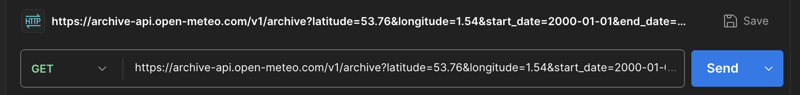
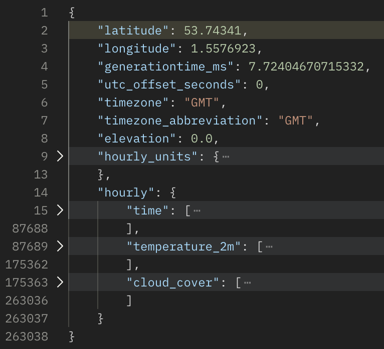
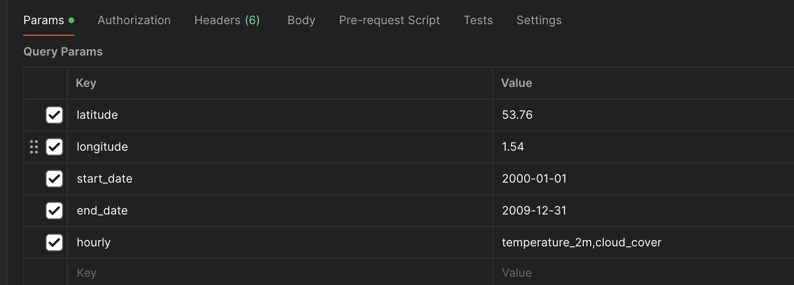
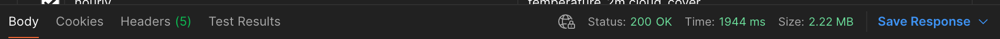

# APIs

API stands for Application Programming Interface. It is a set of rules that
defines how software applications can interact with each other. APIs are used to
allow different software applications to communicate with each other. When
people talk about APIs, they are usually referring to web APIs. These are the
APIs that allow you to interact with a web server. You can use them to send and
receive data from a server, and they are often used to build web applications.
The majority of web apis are `RESTful` APIs which are `json` based. REST stands
for **Re**presentational **S**tate **T**ransfer. It is a set of rules that
developers follow when they create their API. One of the rules is that you
should be able to get a piece of data (called a resource) when you link to a
specific URL. Each URL is called a request, and the data that is sent back to
you is called a response. There are also SOAP APIs, but they are an older
technology based on `XML`, which is becoming less common.

Bothh `SOAP` and `RESTf`ul APIs are often built on top of a traditional
relational database. Instead of returning the entire database, the API returns
only the data that the developer requests. Another designed feature is that APIs
are _read optimised_. API developers typically spend a lot of effort designing
the API to return data that easy to read and use. Thinking back to our database
examples in the previous unit, we might expect the the API to return a
representation of the user, complete with their name, email address, and other
details, rather than just a user ID, for instance:

```json
{
  "name": "Jane Doe",
  "date_of_birth": "1990-01-01",
  "address": {
    "street": "1 Brownberrie Ln",
    "city": "Horsforth",
    "county": "Leeds",
    "postcode": "LS18 5HD"
  },
  "email": "Jane@doe.com",
  "phone": "0113 123 4567"
}
```

This tells us what the (API) developer thinks is most important about a user.

RESTful APIs typically return data in a format called JSON. JSON stands for
JavaScript Object Notation. It is a way of representing data that is easy for
both people and computers to read and write. `JSON` provides a set of `key` and
`value` pairs, where the `key` is a string and the `value` can be a string,
number, boolean, array, or another object.

In the above example, if we wanted to look up Jane Doe's address, we would look
in the `JSON` object for the `address` key, and then look for the `street`,
`city`, `county`, and `postcode` keys.

Using APIs is typically done in code, but there are some tools that can help you
interact with APIs without writing any code. One of the most popular tools is
called `Postman`. Postman is a tool that allows you to send requests to an API
and see the response. It is a great way to explore an API and see what data is
available.

## Activity 3.2.1: Install/Register Postman

_20 minutes_

Postman can be used in one of two ways, either as a standalone application or as
a browser extension. The following activities will work in either version, but
you will need to either install the standalone application or register for a
free account to use the online version.

### Using the online version

In a browser, navigate to the [Postman website](https://www.postman.com/). Click
on the `Sign Up For Free` button in the top right corner of the page. You will
need to provide an email address and create a password. Once you have signed up,
you will be taken to the Postman dashboard.

### Using the standalone application

To use the standalone application, you will need to download and install it. You
can download the application from the
[Postman website](https://www.postman.com/downloads/). You can use postman without signing in, but this will limit the features you can use.  This shouldn't have a bearing for these exercises, but you may want to sign up for a free account to access the full feature set if you intend to use Postman in the future. 

Now that we have Postman installed, we can start exploring some APIs.

Many APIs require an API key to access them. An API key is a unique identifier that is used to authenticate requests to the API. You can think of it as a password that is used to access the API. Another common way to authenticate requests is to use a token. A token is a temporary piece of data that is generated by the API and is used to authenticate requests. Tokens are often used in conjunction with API keys to provide an additional layer of security.

Rather than wrestling with an API that requires authentication, we will use a public API that does not require any authentication. The API we will use is a weather API called meteo. The meteo API provides weather data for cities around the world. You can find more information about the meteo API on the [meteo website](https://open-meteo.com/).

----

## Activity 3.2.2: Exploring the meteo API

_20 minutes_ 

In this activity, we will use Postman to explore the meteo API. We will send a request to the API and see the response.

Meteo has a documentation page that describes the available parameters and how to use the API. You can find the documentation page [here](https://open-meteo.com/en/docs/).

1. Open Postman, in the url bar, make sure the request type is set to `GET` and enter the following URL: 
  
  ```
  https://archive-api.open-meteo.com/v1/archive?latitude=53.76&longitude=1.54&start_date=2000-01-01&end_date=2009-12-31&hourly=temperature_2m,cloud_cover
  ```
This URL will return the temperature and cloud cover data for Leeds, UK. for the decade 2000-2009.

Once you hit the "Send" button, you should see a response from the API. The response will be in JSON format and will contain the temperature and cloud cover data for Leeds, UK.

2. Take a look at the response and see if you can find the temperature and cloud cover data.


3. Try changing the URL to get a different set of data. You can change the latitude and longitude to get data for a different city, or you can change the start and end dates to get data for a different time period.  Postman makes this easier with its `Params` tab, where you can enter the parameters and their values.

4. Once you have changed your query, hit the "Send" button again to see the new response.
5. In the response portion of the window, select the "save response" button to save the response as a file. This will allow you to refer back to the data later.

