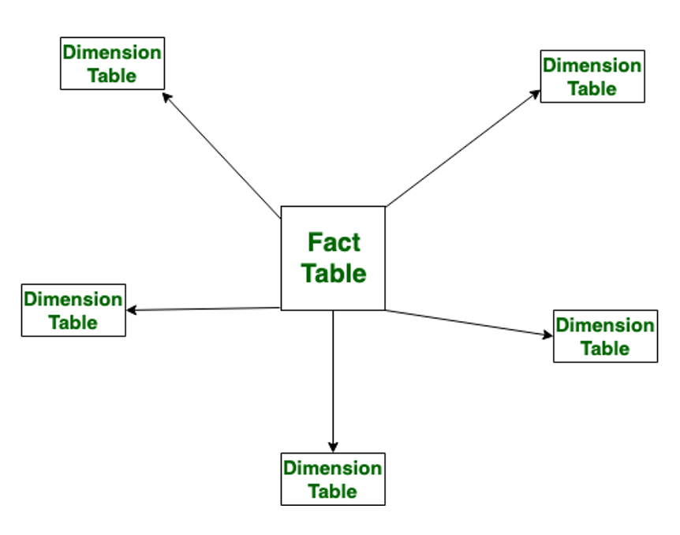
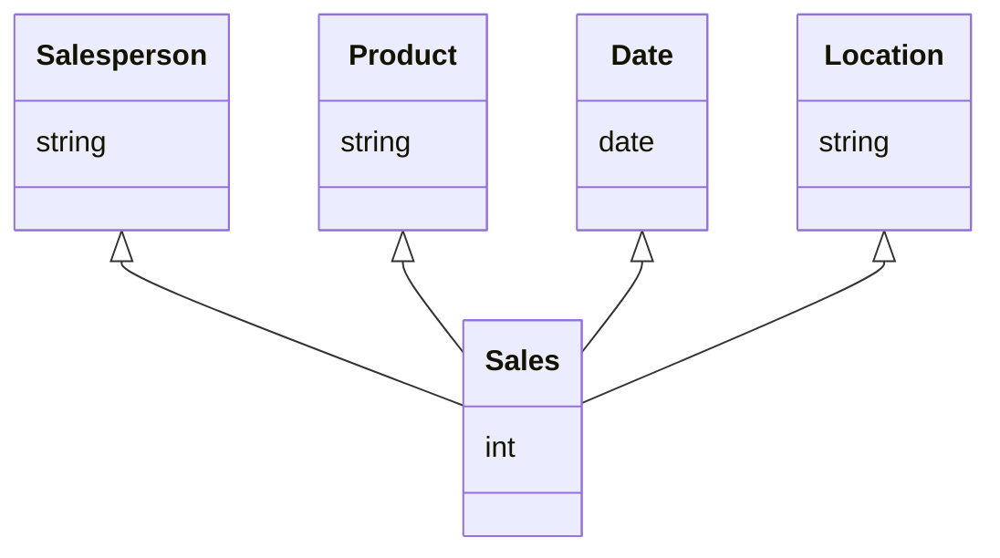
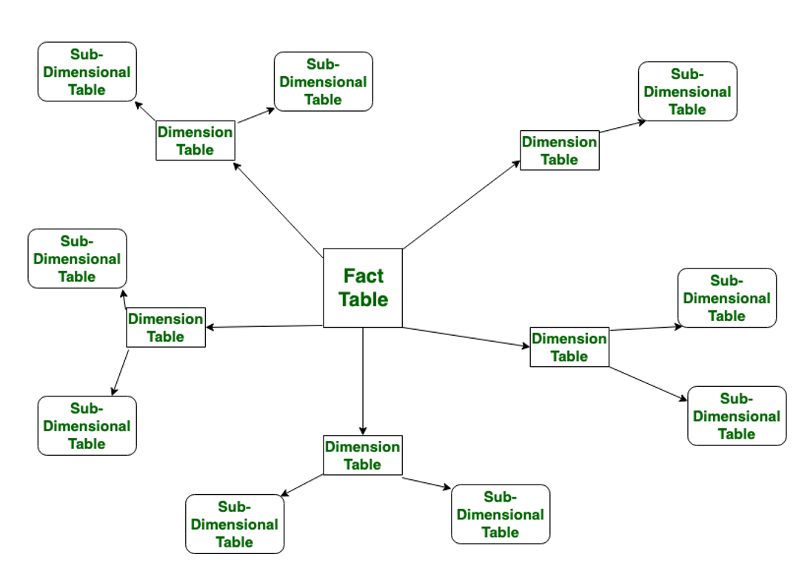
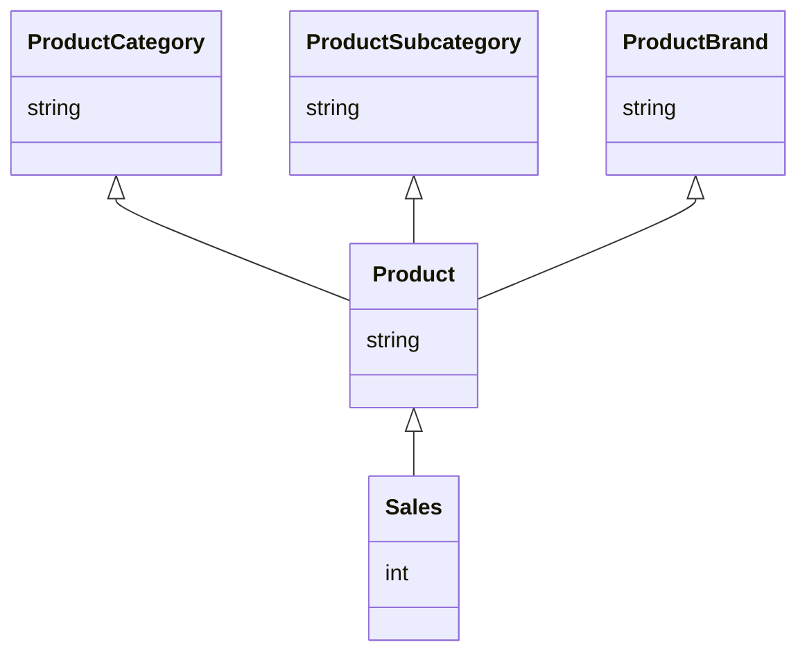

# 3.2: Data Warehousing and other Database types

In the previous section, we looked at how to use SQL to query a database. In
this section, we will look at data warehousing and other types of databases.

## Data Warehousing

Data warehousing is a process that involves collecting, storing, and managing
data from different sources. The data is then used for reporting and analysis.
Data warehousing is typically used in business intelligence and data analytics.  Whilst a data warehouse may use the same underlying technology and query language as a traditional database, the way the data is stored and organized is different. 

## Difference between OLTP and OLAP

The difference between datawarehouses and traditional databases can perhaps be better understood by looking at the different paradigms they are designed with.  
`OLTP` (Online Transaction Processing) and `OLAP` (Online Analytical Processing)
are two different types of databases. OLTP databases are used for transactional
processing, such as recording sales or updating inventory. The previous section
on SQL covered OLTP databases. Data warehousing typically uses OLAP databases.
OLAP databases are used for analytical processing, such as generating reports or
analyzing trends. OLTP databases are typically optimized for write operations,
while OLAP databases are optimized for read operations. More simply, OLTP
databases are designed to add, update, and delete data quickly whereas OLAP
databases are designed to read data quickly. This focus on reading data quickly
means data is often denormalized in OLAP databases to reduce the number of joins
required to retrieve data.

| OLTP                              | OLAP                           |
| --------------------------------- | ------------------------------ |
| atomic transactions               | complex queries                |
| normalized data                   | denormalized data              |
| optimized for write operations    | optimized for read operations  |
| used for transactional processing | used for analytical processing |
| process driven                    | data driven                    |

## Fact and Dimension Tables

A fact table is a table that contains the data that is being analyzed. For instance in a sales database, the fact table might contain sales data. A dimension table contains the context for the data. For instance in a sales database, the dimension table might contain information about the products being sold. 

### Star Schema

The most common way to organize data in a data warehouse is using a
`star schema`. In a star schema, the fact table is at the center, and the
dimension tables are connected to it. This creates a star-like structure, hence
the name.

## Activity 3.2.1: Create a Star Schema

Consider the following data:

| Salesperson | Product | Date       | Location | Sales |
| ----------- | ------- | ---------- | -------- | ----- |
| John        | Apple   | 2021-01-01 | London   | 100   |
| Jeff        | Banana  | 2021-01-02 | Paris    | 200   |
| Jenny       | Apple   | 2021-01-03 | Berlin   | 150   |
| Jane        | Banana  | 2021-01-04 | Madrid   | 250   |

How could this data be organized into a star schema? Draw a diagram to represent
the star schema.

### Discussion

The star schema is a common way to organize data in a data warehouse. It is
simple and easy to understand, making it a good choice for many applications.
However, it can be less flexible than other schema designs, such as the
snowflake schema. The snowflake schema can be more complex to manage but can
also be more efficient for certain types of queries.

## Snowflake Schema

Another common way to organize data in a data warehouse is using a
`snowflake schema`. In a snowflake schema, the dimension tables are normalized,
meaning that they are broken down into smaller tables. This can make the data
easier to manage but can also make queries more complex.

## Activity 3.2.2: Create a Snowflake Schema

Consider the following data:

| Product | Product Category | Product Subcategory | Product Brand | Sales |
| ------- | ---------------- | ------------------- | ------------- | ----- |
| Apple   | Fruit            | Fresh               | Green         | 100   |
| Banana  | Fruit            | Fresh               | Yellow        | 200   |
| Orange  | Fruit            | Fresh               | Orange        | 150   |
| Pear    | Fruit            | Fresh               | Green         | 250   |

How could this data be organized into a snowflake schema? Draw a diagram to
represent the snowflake schema.

### Discussion

## Data lakes

Data lakes are a type of data storage system that stores data in its raw form. Data lakes are typically used in big data applications, where data is collected from a variety of sources and stored in a central location. Different vendors may use terminology such as "data hub", or "buckets" to describe similar concepts. 
Data lakes are often used in conjunction with data warehouses, where data is cleaned and transformed before being loaded into the data warehouse. Data lakes are typically used for *unstructured* or semi-structured data, such as text, images, or videos. Data lakes are often used in distributed systems, where data is spread across multiple servers. This allows for high availability and fault tolerance.

## NoSQL Databases

A common way to interact with data lakes is through NoSQL databases. NoSQL databases are a type of database that do not use the traditional SQL. Whilst the NoSQL query language shares similarity with SQL, it is not the same.  This helps to cater to the unstructured nature of the data stored they store.
NoSQL, or "Not Only SQL", databases are designed to handle large amounts of data and are often used in big data applications. They are typically used for *unstructured* or semi-structured data, such as text, images, or videos. NoSQL databases are often used in distributed systems, where data is spread across multiple servers. This allows for high availability and fault tolerance.

## Activity 3.2.3: Explore NoSQL Databases
_Allow 30 minutes_

LinkedIn Learning has a course on NoSQL databases that you may find useful. The course covers the basics of NoSQL databases, including the different types of NoSQL databases and how to use them. You can find the course [here](https://www.linkedin.com/learning/introduction-to-nosql/).
