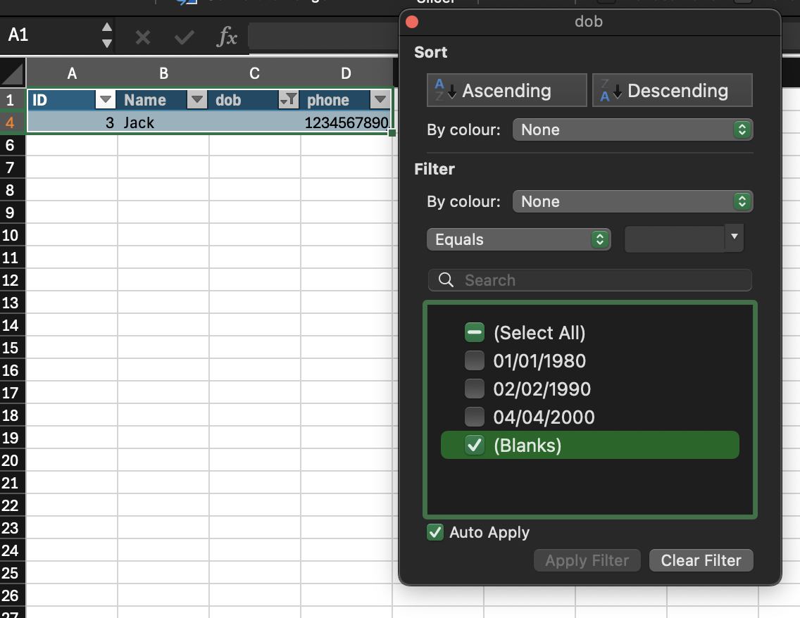
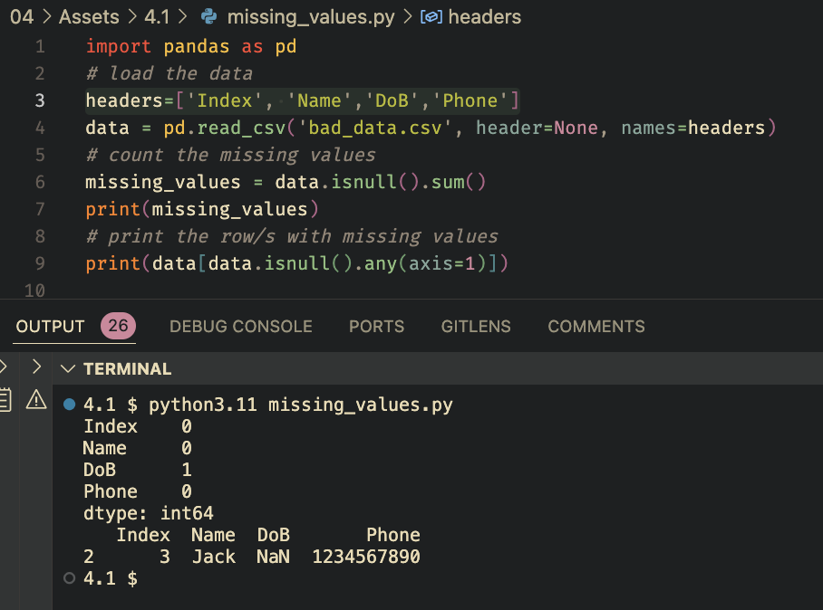
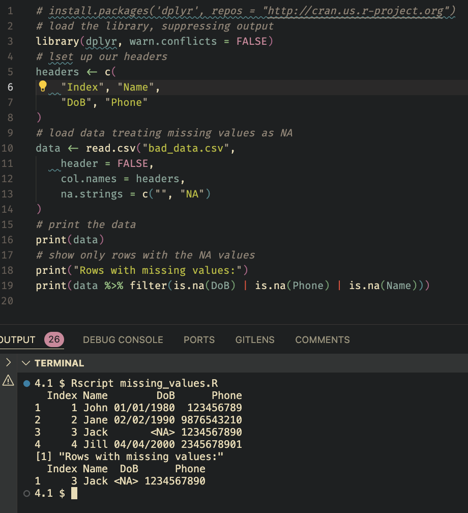

## Univariate Data Analysis

_Univariate data analysis_ is the simplest form of data analysis. It involves
the analysis of a single variable, focusing on its distribution and
characteristics. Univariate data analysis is a fundamental step in data
analysis, as it provides insights into the structure and properties of the data.

When analysing univariate data, we focus on its overall shape and
characteristics. Key questions include:

- Location and spread of data points: What are the typical, minimum, and maximum
  values?
- Distribution pattern: Are data points evenly spread or clustered?
- Data set size: Is it large or small?
- Symmetry: Is the distribution symmetric or skewed?
- Tail weight: Are there many points far from the center, or are outliers rare?
- Clusters: Number, location, and size of any clusters.
- Outliers: Presence of significantly different data points.
- Other features: Any unusual aspects like gaps, sharp cutoffs, or peculiar
  values. Even simple data sets can reveal complex features.

## Missing Values

Consider the following dataset:

| ID  | Name | dob        | phone      |
| --- | ---- | ---------- | ---------- |
| 1   | John | 01/01/1980 | 0123456789 |
| 2   | Jane | 02/02/1990 | 9876543210 |
| 3   | Jack |            | 1234567890 |
| 4   | Jill | 04/04/2000 | 2345678901 |

At a glance, we can see that the third row is missing a date of birth. This is
easy to spot in a small dataset, but in a larger dataset, missing values can be
harder to identify. In Excel, we could create a table (CTRL+T) and filter the
column to show only blanks. This would highlight any missing values, but it's a
manual process that may be difficult to repeat. Instead, we could use the
`ISBLANK` function to identify missing values. For example, in cell `C3`, we
could use the formula `=ISBLANK(C3)` to return `TRUE` if the cell is empty and
`FALSE` if it contains a value. We can chain this logic into a larger formula to
identify missing values in a column, for instance counting the number of blank
values:

```excel
=SUM(IF(ISBLANK(C1:C4),1,0))
```


Setting this up in a secondary sheet would allow us to quickly assess the
quality of our data, even if we re-import it. This is a simple example, but the
same logic can be applied to more complex data.

We could also turn the data into a table and use the `Filter` feature to show
the missing values:  This
however would be a manual process and may break if the data changes.

In Python, we can use the `pandas` library to identify missing values. The
`isnull` function returns a boolean mask of the same shape as the input, with
`True` values where the input is `NaN` (Not a Number) or `None`. We can then use
the `sum` function to count the number of missing values in each column:

```python
import pandas as pd
# load the data
headers=['Index', 'Name','DoB','Phone']
data = pd.read_csv('bad_data.csv', header=None, names=headers)
# count the missing values
missing_values = data.isnull().sum()
print(missing_values)
# print the row/s with missing values
print(data[data.isnull().any(axis=1)])
```



In R, we can use the `dplyr` library to identify missing values. The
`summarise_all` function applies a function to each column in the dataset, in
this case counting the number of missing values:

```r
# install the package - this only needs to be done once
install.packages('dplyr', repos = "http://cran.us.r-project.org")
# load the library, suppressing output
library(dplyr, warn.conflicts = FALSE)
# set up our headers
headers <- c(
    "Index", "Name",
    "DoB", "Phone"
)
# load data treating missing values as NA
data <- read.csv("bad_data.csv",
    header = FALSE,
    col.names = headers,
    na.strings = c("", "NA")
)
# print the data
print(data)
# show only rows with the NA values
print("Rows with missing values:")
print(data %>% filter(is.na(DoB) | is.na(Phone) | is.na(Name)))
```



## Activity 4.1.1

_Allow 30 minutes_

The dataset [here](../Activities/missing_data.csv) contains a number of missing
values. Your task is to identify these missing values. Use the techniques
described above to count the number of missing values in each column.

## Outliers

Outliers are data points that are significantly different from the rest of the
data. They can skew the results of data analysis and make it difficult to draw
meaningful conclusions. Outliers can occur for a variety of reasons, such as
data entry errors, measurement errors, or natural variation in the data. A
common example of outliers is in calculating average income. If we use a mean
average, a few extremely high earners can skew the results, making it appear
that the average income is higher than it actually is. In this case, using the
median average would be more appropriate, as it is less affected by outliers.

### Bell Curve

The bell curve, also known as the normal distribution, is a common pattern in
data analysis. It is a symmetrical curve that is shaped like a bell, with the
highest point in the middle and tapering off at the edges. The bell curve is
used to describe the distribution of many natural phenomena, such as height,
weight, and test scores. In a bell curve, most data points are clustered around
the mean, with fewer data points at the extremes. The bell curve is a useful
tool for understanding the distribution of data and identifying outliers.
Outliers are data points that fall far from the mean, and can be identified by
their distance from the center of the curve. This gives us a robust, reasonably
simple way to identify outliers in our data.

#### Identifying Outliers

There are several methods for identifying outliers in a dataset. One common
approach is to use the interquartile range (IQR). The IQR is the range between
the first and third quartiles of the data, and is a measure of the spread of the
data. Outliers are defined as data points that fall outside a certain multiple
of the IQR from the first and third quartiles. For example, data points that are
more than 1.5 times the IQR from the first and third quartiles are considered
outliers. Another approach is to use z-scores, which measure the number of
standard deviations a data point is from the mean. Data points with z-scores
greater than a certain threshold are considered outliers. These methods can be
used to identify outliers in a dataset and remove them from the analysis.

```python
import pandas as pd
import numpy as np
outlier_df=pd.read_csv('outliers.csv')
# Calculate the first and third quartiles
Q1 = outlier_df['Value'].quantile(0.25)
Q3 = outlier_df['Value'].quantile(0.75)
# Calculate the interquartile range
IQR = Q3 - Q1
# Define the lower and upper bounds
lower_bound = Q1 - 1.5 * IQR
upper_bound = Q3 + 1.5 * IQR
# Identify the outliers
outliers = outlier_df[(outlier_df['Value'] < lower_bound) | (outlier_df['Value'] > upper_bound)]
print(outliers)
```

This is perhaps made more clear with a visualisation:

```python
import seaborn as sns
import matplotlib.pyplot as plt
sns.boxplot(x=outlier_df['Value'])
plt.show()
```

The process in `R` is similar:

```r
# Load necessary libraries
library(dplyr, warn.conflicts = FALSE)
library(ggplot2, warn.conflicts = FALSE)

# Load the data
outlier_df <- read_csv("outliers.csv")

# Calculate quartiles and interquartile range
Q1 <- quantile(outlier_df$Value, 0.25)
Q3 <- quantile(outlier_df$Value, 0.75)
IQR <- Q3 - Q1

# Define bounds and identify outliers
outliers <- outlier_df %>%
  filter(Value < (Q1 - 1.5 * IQR) | Value > (Q3 + 1.5 * IQR))
print(outliers)

# Create a boxplot
ggplot(outlier_df, aes(x = "", y = Value)) +
  geom_boxplot() +
  theme_minimal()
```

## Inconsistent Values

<!-- TODO: either wrong data type or out of bounds para  -->

Inconsistent values are data points that do not conform to the expected format
or range. They can be caused by data entry errors, measurement errors, or other
issues. Inconsistent values can make it difficult to analyse the data and draw
meaningful conclusions. Inconsistent values may be a wrong data type (e.g., the
letter `o` instead of the number `0`), a value that is out of range (e.g., a
negative age), or a value that is not in the expected format (e.g., a date in
the wrong format). Identifying and correcting inconsistent values is an
important step in data analysis, as it ensures that the data is clean and
accurate. Depending on the tools you use, you may find that some inconsistencies
are automatically corrected, or cause the entire dataset to be transformed in an
unexpected way. For example, if you have a column of dates, and one of the dates
is in the wrong format, the entire column may be treated as text, rather than
dates. In this instance, you would have to identify the inconsistent value,
decide how to handle it, then transform the data back to the correct format.

### Unexpected data types

```python

import pandas as pd
import numpy as np
# Load the data
inconsistent_df = pd.read_csv('inconsistent.csv')
# Identify inconsistent values
inconsistent_values = inconsistent_df[~inconsistent_df['Value'].str.isnumeric()]
print(inconsistent_values)
```

We can also quickly identify the column types in a data frame, to see if there
is anything unexpected:

```python
print(inconsistent_df.dtypes)
```

Again, the process is somewhat similar in `R`:

```r
# Load necessary libraries
library(dplyr, warn.conflicts = FALSE)

# Load the data
inconsistent_df <- read_csv("inconsistent.csv")

# Identify inconsistent values
inconsistent_values <- inconsistent_df %>%
  filter(!grepl("^[0-9]+$", Value))
print(inconsistent_values)
```

You'll notice some more exotic code in the R example. The `grepl` function is a
_regular expression_ function that checks if a string matches a pattern. In this
case, we're checking if the string is made up of only numbers. If it isn't,
we're flagging it as inconsistent. Regular expressions are a powerful tool for
data cleaning, but can be complex to learn. They are worth the effort, as they
can save you a lot of time in the long run. Sites such as
[regex101](https://regex101.com/) can help you learn and test regular
expressions.

### Testing for Equality

Another common issue is testing for equality. In some cases, you may have a
column that should contain only a few values, such as `Male` or `Female`. If you
have a typo in one of the values, such as `Femal`, this can cause issues with
your analysis. You can test for equality in a similar way to the above examples:

```python
#  TODO: add python example
```

```r
# TODO: add R example
```

<!-- TODO: add 2 activities -->
