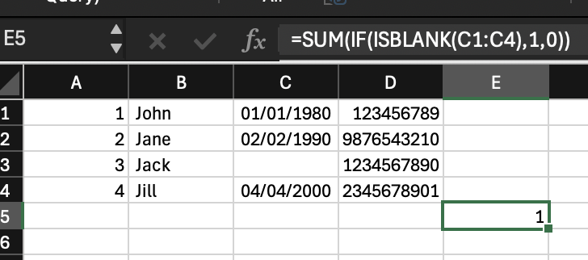

# Working with Unexpected Values

## Univariate Data Analysis

_Univariate data analysis_ is the simplest form of data analysis. It involves
the analysis of a single variable, focusing on its distribution and
characteristics. Univariate data analysis is a fundamental step in data
analysis, as it provides insights into the structure and properties of the data.

When analysing univariate data, we focus on its overall shape and
characteristics. Key questions include:

- Location and spread of data points: What are the typical, minimum, and maximum
  values?
- Distribution pattern: Are data points evenly spread or clustered?
- Data set size: Is it large or small?
- Symmetry: Is the distribution symmetric or skewed?
- Tail weight: Are there many points far from the center, or are outliers rare?
- Clusters: Number, location, and size of any clusters.
- Outliers: Presence of significantly different data points.
- Other features: Any unusual aspects like gaps, sharp cutoffs, or peculiar
  values. Even simple data sets can reveal complex features.

## Multivariate Data Analysis

##

## Activity 4.1.0

_Allow 1 hour_

<!--TODO: create janky dataset that demonstrates typical errors -->

The dataset [here](../Activities/bad_data.csv) contains a number of errors that
you might encounter when working with data. Your task is to identify these
errors. How might you correct them?

## Missing Values

Consider the following dataset:

| ID  | Name | dob        | phone      |
| --- | ---- | ---------- | ---------- |
| 1   | John | 01/01/1980 | 0123456789 |
| 2   | Jane | 02/02/1990 | 9876543210 |
| 3   | Jack |            | 1234567890 |
| 4   | Jill | 04/04/2000 | 2345678901 |

At a glance, we can see that the third row is missing a date of birth. This is
easy to spot in a small dataset, but in a larger dataset, missing values can be
harder to identify. In Excel, we could create a table (CTRL+T) and filter the
column to show only blanks. This would highlight any missing values, but it's a
manual process that may be difficult to repeat. Instead, we could use the
`ISBLANK` function to identify missing values. For example, in cell `C3`, we
could use the formula `=ISBLANK(C3)` to return `TRUE` if the cell is empty and
`FALSE` if it contains a value. We can chain this logic into a larger formula to
identify missing values in a column, for instance counting the number of blank
values:

```excel
=SUM(IF(ISBLANK(C1:C4),1,0))
```



Setting this up in a secondary sheet would allow us to quickly assess the
quality of our data, even if we re-import it. This is a simple example, but the
same logic can be applied to more complex data.

In Python, we can use the `pandas` library to identify missing values. The
`isnull` function returns a boolean mask of the same shape as the input, with
`True` values where the input is `NaN` (Not a Number) or `None`. We can then use
the `sum` function to count the number of missing values in each column:

```python
import pandas as pd
# load the data
data = pd.read_csv('bad_data.csv')
# count the missing values
missing_values = data.isnull().sum()
print(missing_values)
```

In R, we can use the `dplyr` library to identify missing values. The
`summarise_all` function applies a function to each column in the dataset, in
this case counting the number of missing values:

```r
library(dplyr)
# load the data
data <- read.csv('bad_data.csv')
# count the missing values
missing_values <- summarise_all(data, ~sum(is.na(.)))
print(missing_values)
```

## Activity

_Allow 30 minutes_

<!--TODO: create wonky data... -->

The dataset [here](../Activities/missing_data.csv) contains a number of missing
values. Your task is to identify these missing values. Use the techniques
described above to count the number of missing values in each column.

## Outliers

## Inconsistent Values

<!-- TODO: write ~500 words -->

<!-- TODO: add 4 activities -->
