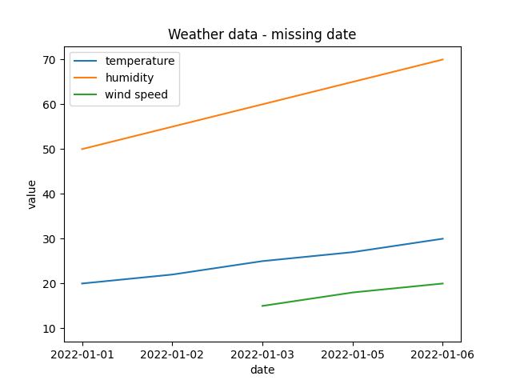
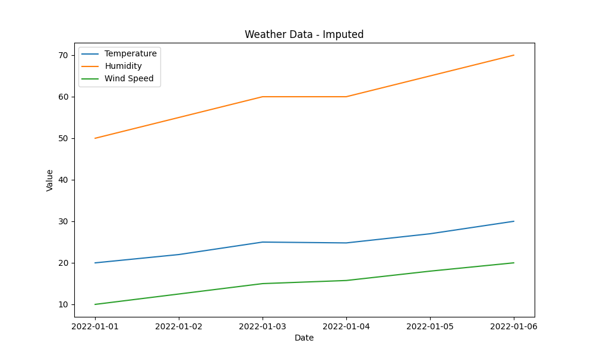

# Data Cleansing

Data cleansing is the process of detecting and correcting (or removing) corrupt
or inaccurate records from a record set, table, or database. It refers to
identifying incomplete, incorrect, inaccurate, irrelevant, or missing parts of
the data and then replacing, modifying, or deleting the dirty or coarse data.
Data cleansing is an essential part of data management and is a crucial step in
data analysis. In databases, a common practice is to develop solutions to ensure
captured data is clean before it is written to the database. This is often done
through the use of constraints and triggers.

In the previous section we discussed how to identify unexpected values in our
data. In this section, we will look at how to handle these issues, and cleanse
our data to ensure that it is accurate and reliable. Data cleansing is an
essential step in the data analysis process, as dirty data can lead to
inaccurate results and misleading conclusions. Data cleansing involves a variety
of techniques, including data imputation, outlier detection, and data
transformation.

## Handling Missing Data

A common scenario in data analysis is dealing with missing data. may be a
missing value within a "row", or an entire "row" of data may be missing. Missing
data can occur for a variety of reasons, such as data collection errors,
equipment failures, or privacy concerns. It is important to handle missing data
properly to avoid bias and ensure the accuracy of the analysis.

If we have a missing row, we may decide to synthesise the missing data by
`imputation`. If we have a missing value within a row, we may decide to drop the
row, or use `imputation` to fill in the missing value.

### Detecting Missing Data

Missing rows of data can be easy to detect in time series data, where a missing
row is a missing time point. Missing values within a row can be more difficult
to detect, as they may be represented by a `null` value, a `0`, or some other
placeholder value.

Consider the following dataset:

| date       | temperature | humidity | wind_speed |
| ---------- | ----------- | -------- | ---------- |
| 2022-01-01 | 20          | 50       | 10         |
| 2022-01-02 | 22          | 55       | NaN        |
| 2022-01-03 | 25          | 60       | 15         |
| 2022-01-05 | 27          | 65       | 18         |
| 2022-01-06 | 30          | 70       | 20         |

If we were to plot this data, we'd have a misleading graph



The missing date `2022-01-04` is not represented in the graph, and the missing
`wind_speed` for `2022-01-02` is not represented in the graph. We need to detect
and handle these missing values to ensure the accuracy of our analysis.

We can look at the missing row first; this is easy to identify and correct
without any guesswork. Identifying the row and filling in the missing data is
straightforward.

```python
import pandas as pd
import numpy as np

# Create the data
data = {
    'date': pd.to_datetime(['2022-01-01', '2022-01-02', '2022-01-03', '2022-01-05', '2022-01-06']),
    'temperature': [20, 22, 25, 27, 30],
    'humidity': [50, 55, 60, 65, 70],
    'wind_speed': [10, np.nan, 15, 18, 20]
}

# Add the data to a DataFrame
df = pd.DataFrame(data)

# Calculate the date range
date_range = pd.date_range(start=df['date'].min(), end=df['date'].max())

# Create a DataFrame with the full date range
full_dates = pd.DataFrame({'date': date_range})

# Merge the original DataFrame with the full date range DataFrame
df = pd.merge(full_dates, df, on='date', how='left')

print(df)
```

The output will look like this:

|     | date       | temperature | humidity | wind_speed |
| --- | ---------- | ----------- | -------- | ---------- |
| 0   | 2022-01-01 | 20.0        | 50.0     | 10.0       |
| 1   | 2022-01-02 | 22.0        | 55.0     | NaN        |
| 2   | 2022-01-03 | 25.0        | 60.0     | 15.0       |
| 3   | 2022-01-04 | NaN         | NaN      | NaN        |
| 4   | 2022-01-05 | 27.0        | 65.0     | 18.0       |
| 5   | 2022-01-06 | 30.0        | 70.0     | 20.0       |

We now have the missing row, we can safely assume that the date is `2022-01-04`,
but we need to decide how to fill in the missing values for `temperature`,
`humidity`, and `wind_speed`.

## Induction Vs Deduction

The example above is an example of deduction, where we know the missing row is
`2022-01-04` and we can fill in the missing data. In contrast, induction is less
certain. We may have a missing value within a row, and we need to make an
educated guess about the missing value based on the values of other data points.
These educated guesses are another facet of the judgement calls that are part of
the data analysis process. Even though these are "guesses", they are based on
the data and the context of the analysis. It is our duty to make these guesses
as robustly as possible.

### Imputation

Imputation is an inductive method to fill in missing values. Imputation looks at
the values of other data points to make an educated guess about the missing
value. Filling missing values _within_ a row is more nuanced. We cannot be sure
of the missing values in the same way we can be sure of the missing row. We can
use `imputation` to fill in the missing values. Imputation relies on making an
educated guess about the missing values based on the values of other data
points. There are several common imputation methods, including `mean`, `median`,
`mode`, `KNN`, and `regression imputation`. The choice of imputation method
depends on the nature of the missing data and the specific analysis goals.

There are several common imputation methods ranging from `mode`, `mean`,
`median`, to more sophisticated techniques like `KNN` or
`regression imputation`. The choice of imputation method depends on the nature
of the missing data and the specific analysis goals.

Let's see how to perform imputation using Python and pandas. Consider the
following dataset:

|     | A   | B    | C   |
| --- | --- | ---- | --- |
| 0   | 1.0 | 10.0 | 100 |
| 1   | 2.0 | 20.0 | NaN |
| 2   | NaN | 30.0 | 300 |
| 3   | 4.0 | NaN  | 400 |
| 4   | 5.0 | 50.0 | 500 |

In this dataset, columns A and B have missing values. We can use imputation to
fill in these missing values. For example, we can use mean imputation to replace
the missing values in column A with the mean of the column:

````python
```python
import pandas as pd
import numpy as np

data = {
    'A': [1, 2, np.nan, 4, 5],
    'B': [10, 20, 30, np.nan, 50],
    'C': [100, np.nan, 300, 400, 500]
}

df = pd.DataFrame(data)

# Mean imputation for column A
df['A'] = df['A'].fillna(df['A'].mean())
# Median imputation for column B
df['B'] = df['B'].fillna(df['B'].median())
# mode imputation for column B
df['C'] = df['C'].fillna(df['C'].mode()[0])

print(df)
````

In this example, we used mean imputation to replace the missing values in column
A with the mean of the column. We used median imputation to replace the missing
values in column B with the median of the column. We used mode imputation to
replace the missing values in column C with the mode of the column.

The result looks like this:

|     | A   | B   | C   |
| --- | --- | --- | --- |
| 0   | 1.0 | 10  | 100 |
| 1   | 2.0 | 20  | 100 |
| 2   | 3.0 | 30  | 300 |
| 3   | 4.0 | 30  | 400 |
| 4   | 5.0 | 50  | 500 |

There are more sophisticated methods like KNN or regression imputation that
provide a more nuanced approach to imputing missing values. KNN imputation, for
example, uses the values of the k nearest neighbors to estimate the missing
value. Regression imputation uses regression models to predict missing values
based on other variables in the dataset.

```python
import pandas as pd
import numpy as np
from sklearn.impute import KNNImputer


data = {
    'A': [1, 2, np.nan, 4, 5],
    'B': [10, 20, 30, np.nan, 50],
    'C': [100, np.nan, 300, 400, 500]
}
df = pd.DataFrame(data)
# KNN imputation
print("KNN imputation")
knn_imputer = KNNImputer(n_neighbors=2)
df_knn = knn_imputer.fit_transform(df)
print(df_knn)
```

_KNN results_

|     | A   | B   | C   |
| --- | --- | --- | --- |
| 0   | 1.0 | 10  | 100 |
| 1   | 2.0 | 20  | 250 |
| 2   | 3.0 | 30  | 300 |
| 3   | 4.0 | 35  | 400 |
| 4   | 5.0 | 50  | 500 |

For regression imputation, we can use the `IterativeImputer` class from the
`sklearn.impute` module:

```python
import pandas as pd
import numpy as np
from sklearn.linear_model import LinearRegression

data = {
    'A': [1, 2, np.nan, 4, 5],
    'B': [10, 20, 30, np.nan, 50],
    'C': [100, np.nan, 300, 400, 500]
}
df = pd.DataFrame(data)

# Linear regression imputation
print("linear regression imputation")
linreg_imputer = LinearRegression()
df_linreg = df.copy()
for column in df_linreg.columns:
    missing = df_linreg[column].isnull()
    X = df_linreg[~missing].index.values.reshape(-1, 1)
    y = df_linreg[~missing][column]
    linreg_imputer.fit(X, y)
    df_linreg.loc[missing, column] = linreg_imputer.predict(
        df_linreg[missing].index.values.reshape(-1, 1))
print(df_linreg)
```

_Linear regression results_

|     | A   | B   | C   |
| --- | --- | --- | --- |
| 0   | 1.0 | 10  | 100 |
| 1   | 2.0 | 20  | 200 |
| 2   | 3.0 | 30  | 300 |
| 3   | 4.0 | 40  | 400 |
| 4   | 5.0 | 50  | 500 |

It's important to choose the appropriate imputation method based on the nature
of the missing data and the specific analysis goals. Overly simplistic methods
like mean/median imputation might introduce bias if the missing values are not
randomly distributed. More sophisticated methods like KNN or regression
imputation can provide more accurate estimates but might require additional
computational resources particularly for large datasets. The below table shows
the pros and cons of each imputation method:

| Imputation method | Pros                                         | Cons                                    | Best used when                       |
| ----------------- | -------------------------------------------- | --------------------------------------- | ------------------------------------ |
| Mean              | Simple, easy to implement                    | Can introduce bias                      | values are missing at random         |
| Median            | Robust to outliers                           | Ignores relationships between variables | values are missing at random         |
| Mode              | Appropriate for categorical variables        | Ignores relationships between variables | values are missing at random         |
| KNN               | Accounts for relationships between variables | Computationally expensive               | values are **not** missing at random |
| Regression        | Accounts for relationships between variables | Computationally expensive               | values are **not** missing at random |

Returning to our weather data example, we can use imputation to fill in the
missing values for `temperature`, `humidity`, and `wind_speed`. The general
trajectory of these values is increasing, so using a `mean` or `median`
imputation may be flawed; we may want to use a more sophisticated method like
`KNN` or `regression imputation` which would more likely provide a more accurate
estimate.

```python

import pandas as pd
import numpy as np
from sklearn.impute import KNNImputer

data = {
    'date': pd.to_datetime(['2022-01-01', '2022-01-02', '2022-01-03', '2022-01-04', '2022-01-05', '2022-01-06']),
    'temperature': [20, 22, 25, np.nan, 27, 30],
    'humidity': [50, 55, 60, np.nan, 65, 70],
    'wind_speed': [10, np.nan, 15, np.nan, 18, 20]
}
df = pd.DataFrame(data)
# KNN imputation
print("KNN imputation")
knn_imputer = KNNImputer(n_neighbors=2)
df_knn = knn_imputer.fit_transform(
    df[['temperature', 'humidity', 'wind_speed']])
df[['temperature', 'humidity', 'wind_speed']] = df_knn

```

this fills the gaps in the data with the following values:

|     | date       | temperature | humidity | wind_speed |
| --- | ---------- | ----------- | -------- | ---------- |
| 0   | 2022-01-01 | 20.0        | 50.0     | 10.0       |
| 1   | 2022-01-02 | 22.0        | 55.0     | 12.5       |
| 2   | 2022-01-03 | 25.0        | 60.0     | 15.0       |
| 3   | 2022-01-04 | 24.8        | 60.0     | 15.75      |
| 4   | 2022-01-05 | 27.0        | 65.0     | 18.0       |
| 5   | 2022-01-06 | 30.0        | 70.0     | 20.0       |

We can now plot the data with the missing values filled in:



## Activity 4.3.1

Try using different imputation methods to fill in the missing values in the
data, the choice of method depends is a judgement call based on the nature of
the missing data and the specific analysis goals.

You can recreate the plot using the following code:

```python
import matplotlib.pyplot as plt
import pandas as pd
# create your data frame with a name of `df`

plt.figure(figsize=(10, 6))
plt.plot(df['date'], df['temperature'], label='Temperature')
plt.plot(df['date'], df['humidity'], label='Humidity')
plt.plot(df['date'], df['wind_speed'], label='Wind Speed')
plt.xlabel('Date')
plt.ylabel('Value')
plt.title('Weather Data - Imputed')
plt.legend()
plt.savefig('Assets/weather_data_imputed.png')
plt.show()
```

## Handling Outliers

### Z-Score

The Z-score is a measure of how many standard deviations an element is from the
mean.

### Knowing when to drop outliers

Ultimately, knowing when to drop outliers is a judgement call. Statistical
methods may provide guidance, but the decision to drop outliers should be based
on domain knowledge and the goals of the analysis. Your analysis may become
flawed if you drop outliers that are actually valid data points, for instance
the discovery of ozone layer depletion was delayed because "automated data
collection tools discarded readings that were too low."
@oreillyradarteamBigDataNow2011 [p10]

<!-- TODO: add 4 activities -->
