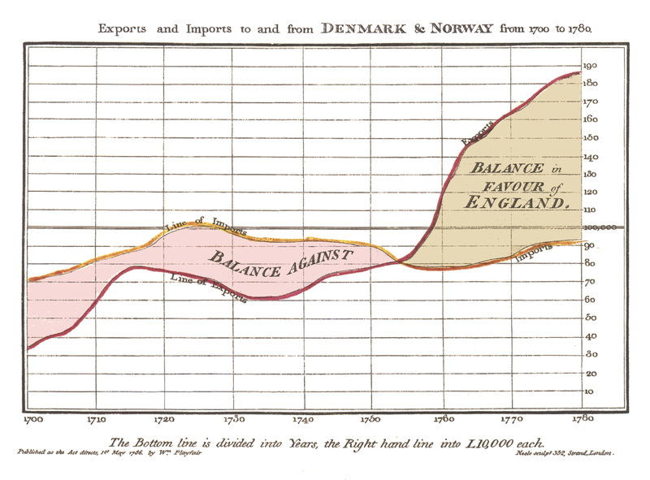
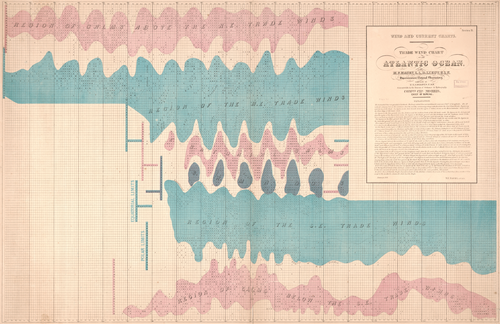
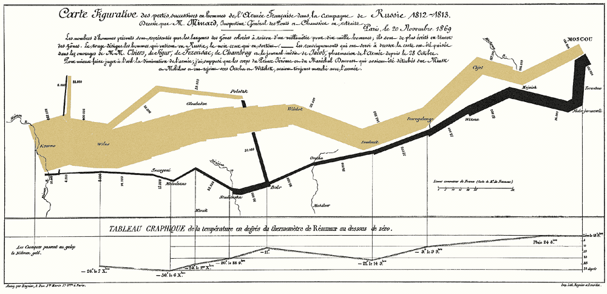
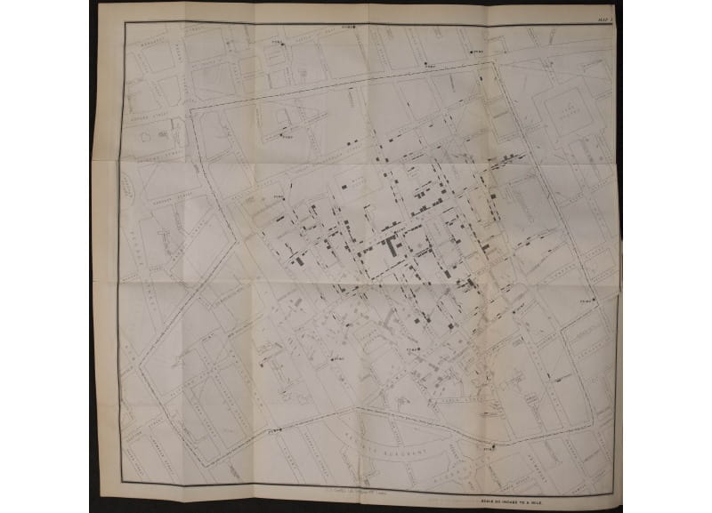
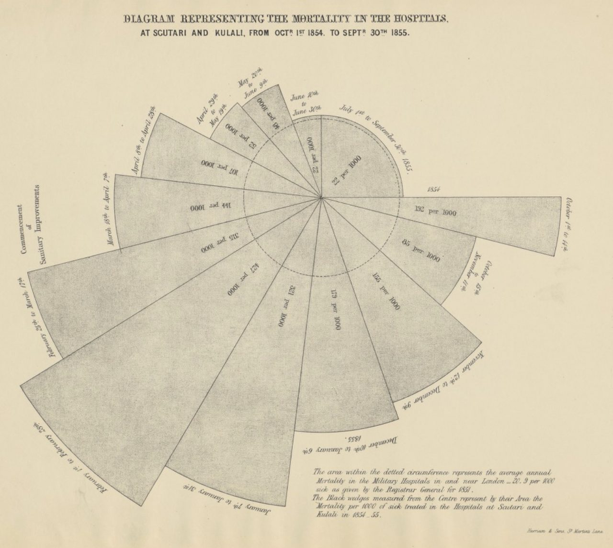

# 7.1: Data Visualisation History

Data visualisation has a long history. Maps, charts, and graphs have been used
for centuries to communicate information and tell stories. In this section, we
will explore the history of data visualisation and look at some of the key
developments in the field. Though data visualisation has been around for
centuries, it is the past two hundred years that have seen the most significant
developments in the field. In the 19th century, advances in printing technology
made it possible to produce detailed maps and charts that could be distributed
to a wide audience. This led to an explosion of interest in data visualisation,
as people realised the power of visualising data to communicate complex
information in a simple and compelling way.

## Data Visualisation before the 20th Century

Before the 20th century, plots were limited by the lack of technology. Data was
collected and analysed by hand, and plots were drawn by hand. This made it
difficult to produce detailed and accurate plots, and limited the amount of data
that could be visualised. Despite these limitations, there were some notable
examples of data visualisation before the 20th century. The first "golden age"
of data visualisations was in the late 19th century, spurred by advances in
printing technology and an increased interest in data analysis. During this
period, data visualisation became a powerful tool for communicating complex
information in a simple and compelling way.

### William Playfair's Charts

William Playfair was a Scottish engineer and economist who is credited with
inventing the line chart, bar chart, and pie chart. Playfair's charts pre-date
the golden age, but they were a clear precursor to the more detailed and
accurate visualisations that would follow. Playfair's charts were a significant
advance in data visualisation, as they made it possible to represent complex
data in a simple and intuitive way. Playfair's charts were widely used in the
19th century to communicate economic and statistical information, and they are
still used today to present data in a clear and concise way.

### Matthew Fontaine Maury's Wind and Current Charts

Matthew Fontaine Maury was a United States Navy officer who is credited with
creating the first wind and current charts. Maury collected data on the winds
and currents of the world's oceans, and used this data to create detailed charts
that showed the prevailing winds and currents in different parts of the world.
Maury's charts were a significant advance in data visualisation, as they made it
possible to visualise complex patterns in the data and to use this information
to navigate the world's oceans more effectively.

### Charles Minard's Napoleon's March

Charles Minard's map of Napoleon's 1812 March on Russia from 1869 is one of the
most famous examples of data visualisation. Tufte called it "the best
statistical graphic ever drawn". @tufte1983visual

The map shows the size of Napoleon's army as it marched to Moscow and back, and
the number of troops that survived the campaign. The map is a powerful tool for
communicating the scale of the campaign and the devastating losses suffered by
the French army.

What is particularly remarkable about this graphic is that it shows
multi-dimensional data in a single image. It shows the size of the army, the
direction of the march, the temperature, and the number of troops that survived.
It is a powerful example of how data visualisation can be used to communicate
complex information in a simple and compelling way.

### John Snow's Cholera Map

In the 1850s, London was besieged by a cholera epidemic. Many physicians at the
time believed that the disease was spread through the air. They could not
explain why the disease was more prevalent in some areas than others. Because of
this, the disease could not be controlled.

John Snow was a physician who believed that the disease was waterborne. He
plotted the locations of cholera deaths on a map of London, and discovered that
the deaths were clustered around a single water pump on Broad Street. By
removing the pump handle, Snow was able to stop the outbreak, and in doing so,
he laid the foundation for modern epidemiology.

The power of this map was that it clearly communicated the pattern of the
disease and its relationship to the water pump. It was a powerful tool for
persuading policymakers to take action to prevent the spread of the disease.

### Mary Nightingale's Rose Diagram

Another early example of data visualisation is Mary Nightingale's rose diagram.
In 1858, Nightingale used the diagram to show the causes of mortality in the
British Army during the Crimean War. The diagram showed that the majority of
deaths were due to preventable diseases, and that improvements in sanitation and
hygiene could save lives. Nightingale's diagram was a powerful tool for
persuading policymakers to make changes that would improve public health.

Though more complex than Snow's map, Nightingale's diagram was still a powerful
tool for communicating complex information in a simple and compelling way.

## Data Visualisation in the 20th Century

The 20th century initially saw limited innovation in data visualisation; the
technology was not yet available to produce detailed and accurate
visualisations. Instead, scientists prioritized numerical precision over
visual representation, leading to a decline in data visualisation's popularity.
Despite this, there were some

### Statistical Graphics

In the early 20th century, statisticians such as Francis Galton and Karl Pearson
developed new techniques for visualising data. Galton's scatter plot, for
instance was a significant advance in data visualisation, as it made it possible
to represent the relationship between two variables in a simple and intuitive
way. Pearson's correlation coefficient was another significant advance, as it
made it possible to quantify the strength of the relationship between two
variables. The combination of these tools made it possible to explore complex
relationships in the data and to draw insights from it.

## Activity 7.1.1

_Allow 1 hour_

Michael Friendly is a leading expert in data visualisation. He has written extensively on the [history of data visualisation](https://www.datavis.ca/papers/gfkl.pdf)

locate the article Friendly, M. (2002). A Brief History of Data Visualization.
Handbook of Data Visualization, 15-56. (DOI:10.1002/jhbs.20078) in the library
search engine.

<!--[also available here](https://datavis.ca/papers/friendly-scat.pdf).-->  Read the article and consider how you may use scatterplots in your own work. What are the advantages and disadvantages of scatter plots? How can you use them to explore relationships in your data?

However, the latter half of the 20th century witnessed a transformative shift
driven by technological advancements and a renewed focus on effective
communication. Due to a general low level of data literacy, the visualisations
in the first half of the 20th century were often misleading.

Researchers such as John W. Tukey developed evangelised visualization techniques
and emphasized the importance of exploration, clarity and accuracy. Combined
with the advent of computers, which enabled the processing and visualization of
vast datasets, data visualization expanded into various fields, including
business, science, and government. Early forms of interactive visualization
emerged, laying the groundwork for modern tools. Edward Tufte published his
seminal work, The Visual Display of Quantitative Information, which laid out the
principles of effective data visualization. These developments laid the
foundation for modern data visualization and set the stage for the explosive
growth of the field in the 21st century.

## Activity 7.1.2

_Allow 1 hour_

Edward Tufte is often referred to as the "Galileo of graphics" for his work in data visualisation. His seminal work, [The Visual Display of Quantitative Information](https://www.edwardtufte.com/tufte/books_vdqi) laid the groundwork for modern data visualisation. Read the book and take notes on the key principles of effective data visualisation that Tufte outlines. How can you apply these principles in your own work?

<!-- TODO: mention infographics, call back to literacy -->

<!-- TODO: add 4 activities -->
