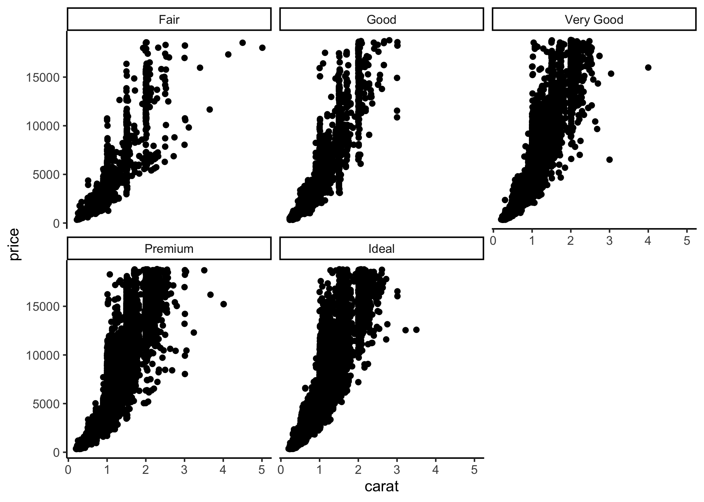

# 7.3: Types of Visualisation

## Introduction

In the previous section, we discussed the key concepts that underpin it. In this
section, we will explore the different types of visualisation techniques that
are commonly used in data science. Often, the most compelling way to communicate
insights from data is through the most simplistic visualisation. There may be a
tension between the simplicity of the visualisation and the complexity of the
data. The key is to find the right balance between the two. The aim should
always be to communicate the insights to the audience in the most effective way
possible. Depending on their data literacy, tims may mean using a simple bar
chart or even a table. For more sophisticated audiences, it may mean using a
more complex visualisation such as a heat map or a network diagram.

Below is a list of common visualisation types, and their generic use cases:

| Type of Visualisation | data type   | Audience | Use Case      |
| --------------------- | ----------- | -------- | ------------- |
| Bar Chart             | Categorical | General  | Comparison    |
| Line Chart            | Time Series | General  | Trends        |
| Pie Chart             | Categorical | General  | Composition   |
| Box Plot              | Numerical   | Advanced | Distribution  |
| Violin Plot           | Numerical   | Advanced | Distribution  |
| Density Plot          | Numerical   | Advanced | Distribution  |
| Scatter Plot          | Numerical   | General  | Correlation   |
| Heat Map              | Numerical   | Advanced | Correlation   |
| Network Diagram       | Graph       | Advanced | Relationships |

In the next section, we will explore each of these visualisation types in more detail.

## Bar Chart

## Line Chart

## Scatter Plot

## Pie Chart

## Box Plot

## Violin Plot

## Density Plot

## Heat Map

## network Diagram

## Facet Grid

