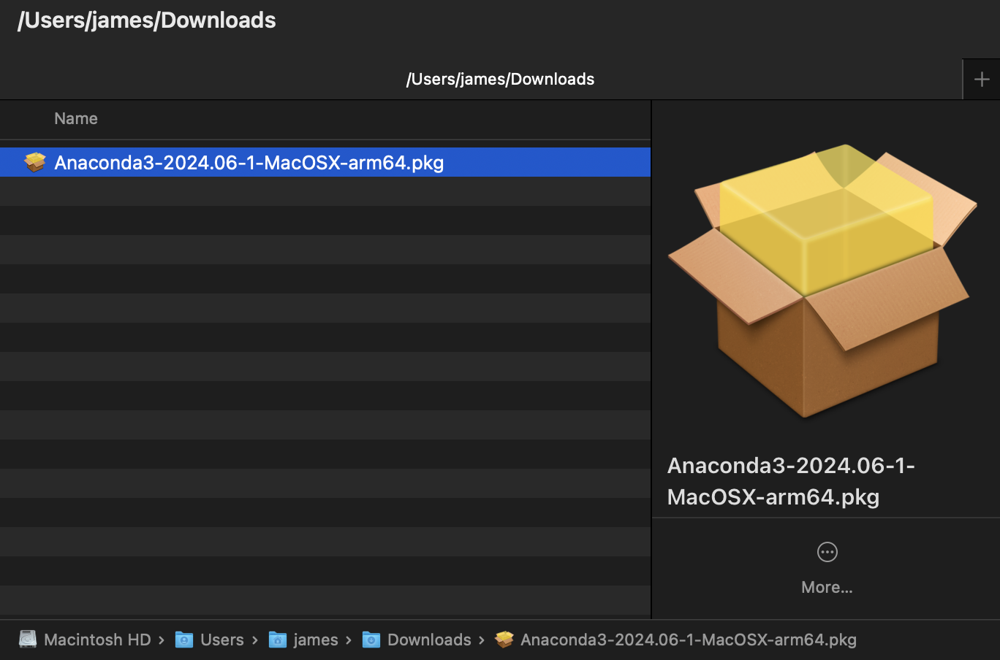

# Anaconda

Anaconda is a popular distribution that packages popular data science tools
together. It includes Python, Jupyter notebooks, and a range of libraries that
are commonly used in data science, such as pandas, numpy, and scikit-learn.
Anaconda also comes with a package manager called conda that makes it easy to
install and manage additional libraries.

Anaconda is a good choice if you are new to data science and want to get up and
running quickly. It provides a complete environment that is ready to use out of
the box, so you can start working on your projects without having to worry about
setting up your development environment. Anaconda also makes it easy to create
and manage virtual environments, which are essential for managing dependencies
in data science projects, and making your code share-able with others. A final
benefit of Anaconda is that it is self-contained; if you decide that you no
longer want to use Anaconda, you can remove it without affecting your system's
Python installation.

Despite the convenience of Anaconda, there are a couple of downsides to
consider. Anaconda is a large download, and will take up at least 4 GB of disk
space. One of the reasons for this disk usage is the number of libraries and
applications that are installed. You may find that the Anaconda installation
includes tools that you will never use. Removing these tools is difficult, and
may break the Anaconda environment. The complexity of Anaconda can also make it
slower to start up than using locally installed libraries. Despite these
drawbacks, Anaconda is a good choice for beginners, and for those who want to
get up and running quickly.

## Activity 10.0.1 (Optional)

_Allow 30 minutes_

# Install Anaconda

The installation of Anaconda is straightforward. You can download the installer
from the [Anaconda website](https://www.anaconda.com/download/success). Once you
have downloaded the installer, you can run it and follow the on-screen
instructions to install Anaconda on your computer.

The instructions below are for MacOS, but the process for Windows and Linux is
similar.

1. Download the installer from the Anaconda website. Choose the relevant
   installer for your operating system (Windows, MacOS, or Linux).
   
2. once the installer has downloaded, open it.
   
3. Follow the on-screen instructions to install Anaconda.

   

   (click `continue`)

   

   (click `continue`)

   

   (read the license agreement, and click `continue`)

   

   (choose the installation location. You'll likely want to install it for "all
   users", and click `continue`)

   

   (There is limited benefit to customising the installation type. Click
   `install`)

   

   (click `continue`) You should now have a working installation of Anaconda on
   your computer.

## Activity 10.0.2: Watch a video on Anaconda

Anaconda has a gentle introduction to Anaconda on their website. You can find it
[here](https://freelearning.anaconda.cloud/get-started-with-anaconda/136733).

### Install Miniconda

The installation of Miniconda is also straightforward. You can download the
installer from the
[Miniconda website](https://docs.conda.io/en/latest/miniconda.html). Once you
have downloaded the installer, you can run it and follow the on-screen
instructions to install Miniconda on your computer, the installation process is
almost exactly the same as for Anaconda, but the resulting installation is less
than a quarter of the size.

## Activity 10.0.3

_Allow 30 minutes_

If you intend to use either Anaconda or Miniconda, there is a useful guide in
Appendix D of "A Hands-On Introduction to Data Science" that covers installing
and configuring tools.
