# Other Tools: R

## Activity 10.0.1

_allow 1 hour_

Read Chapter 6 of "A hands-on introduction to data science" by Shah, C. (2020).
This chapter covers the basics of R and RStudio. It is a good introduction to
the language and the environment.

## Installing R

R is a programming language and free software environment for statistical
computing and graphics supported by the R Foundation for Statistical Computing.
The R language is widely used among statisticians and data miners for developing
statistical software and data analysis. There are two components to R: the R
language (the code) and the R Server (the environment). The environment is where
you run the code, so you need to install both components to use R.

There is a piece of software called RStudio that provides a user-friendly
interface to R. It is a powerful tool that makes it easier to write and run R
code. RStudio is not required to run R, but it is highly recommended.

To install R, go to the [R Project website](https://www.r-project.org/) and
download the version for your operating system. Once you have installed R, you
can install RStudio by going to the [RStudio website](https://www.rstudio.com/)
and downloading the version for your operating system. You may also find that
RStudio is available in your package manager.

| Operating System | R Installation                | RStudio Installation           |
| ---------------- | ----------------------------- | ------------------------------ |
| Windows          | `winget install R`            | `winget install RStudio`       |
| macOS            | `brew install R`              | `brew install --cask rstudio`  |
| Linux            | `sudo apt-get install r-base` | `sudo apt-get install rstudio` |

If you are planning on setting up a full data science environment, you may want
to consider Anaconda. Anaconda is a distribution of Python and R that comes with
a lot of the tools you will need for data science. You can download Anaconda
from the [Anaconda website](https://www.anaconda.com/). This takes up far more
space than just installing R and RStudio, but it is a good option if you are
planning on doing a lot of data science work.

## Activity 10.0.2

_Allow 20 minutes for this activity_

Install R and RStudio on your computer.

# Using RStudio

Once installed, you should be presented with a screen that looks like this:

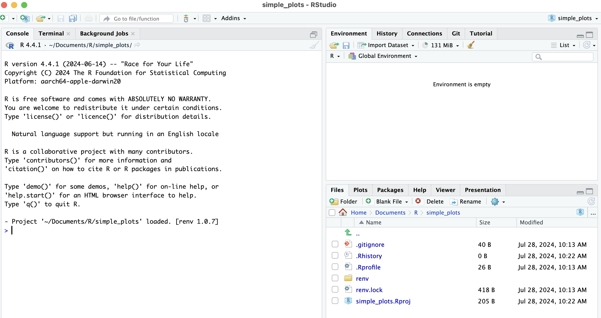

A good rule of thumb is that each piece of analysis should exist in its own R
project. This makes it easier to keep track of your work and share it with
others. To create a new project, click on `File` in the top left corner, then
`New Project`. You will be presented with a dialog box that looks like this:
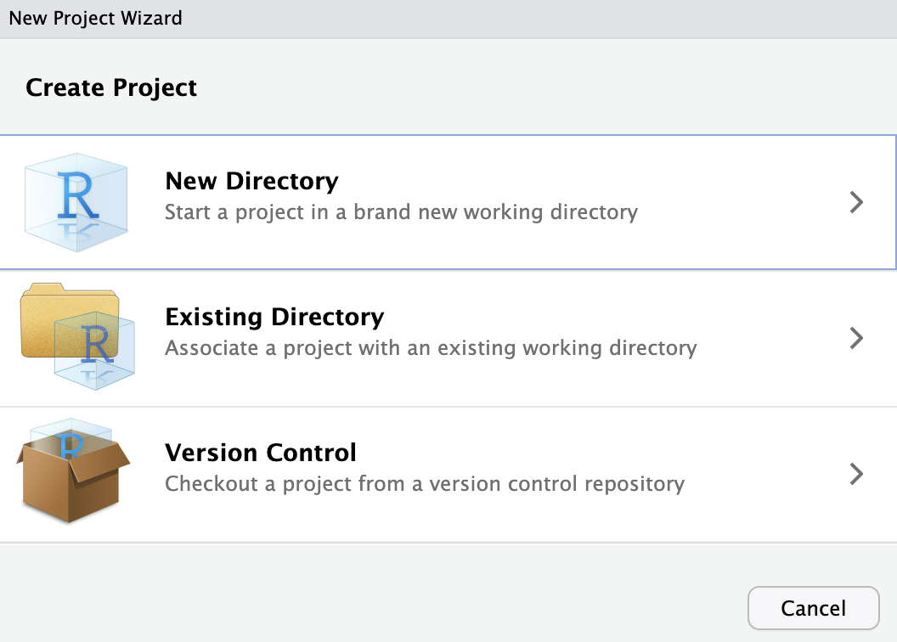

Select `New Directory` and then `New Project`. You will be presented with a
dialog box that looks like this:

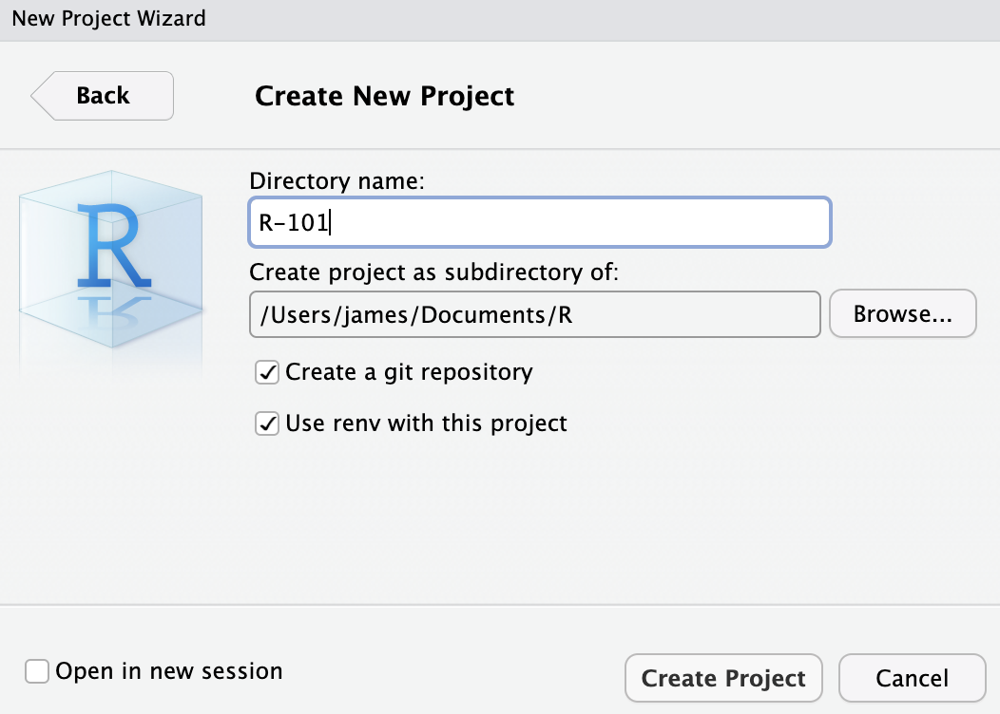

Give your project a name and select a location to save it. You can also choose
to create a new Git repository for your project. This will enable you to track
changes to your project over time, and share your work on services like
[gitlab.com](https://gitlab.com) or [github.com](https://github.com). The
`Use renv with this project` option is used to manage the packages you use in
your project. This helps ensure that all the packages you use are tracked and
can be installed by others. The final option is to open the project in a new
session. This will open a new instance of RStudio with the project loaded. Once
you have filled in the details, click `Create Project`.

Now we have an R project, we can start writing some code. The RStudio interface
is divided into four panes: the Console, the Environment, the Files, and the
Plots. The Console is where you can type R code and see the output. The
Environment shows you the variables you have defined and their values. The Files
pane shows you the files in your project, and the Plots pane shows you the plots
you have created.

### Installing Packages

In R, you can extend the functionality of the language by installing packages.
Packages are collections of functions that are not included in the base R
installation. You can install packages using the `install.packages()` function.
This will installation method will make the package available to all R projects
on your computer.

For example, to install the `ggplot2` package, you would run the following code
in the console:

```R
install("ggplot2")
```

`ggplot2` is a popular package for creating plots in R. It allows you to create
complex plots with a few lines of code. It is based on ideas from the seminal
book
[Grammar of Graphics](https://link.springer.com/book/10.1007/0-387-28695-0).
`ggplot2` is widely used in industry with companies like the
[BBC](https://github.com/bbc/bbplot) relying on it to produce high quality
graphics.

Using the `install()` function is good if we don't need to share our code, but
if we want to share our code with others, we should use `renv` package to manage
our environment so it can be reproduced in its entirety.

Let's try that now.

## Activity 10.0.3

_Allow 20 minutes for this activity_

This activity will take us through activating our project's `renv` environment,
installing the `ggplot2` package, update the `renv.lock` file, and creating a
simple plot. These steps will enable us to share our code with others and ensure
that they can run it without any issues, irrespective of the packages they have
installed on their system.

### Steps

1. activate the `renv` environment for your project. To activate the `renv` run
   the following code in the console:

   ```R
   renv::activate()
   ```

   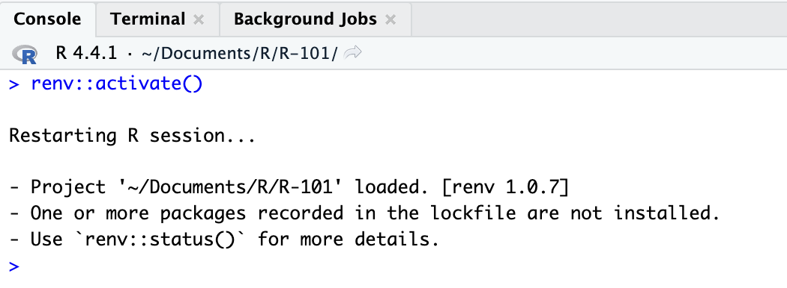

2. Install the `ggplot2` package in your R session.
   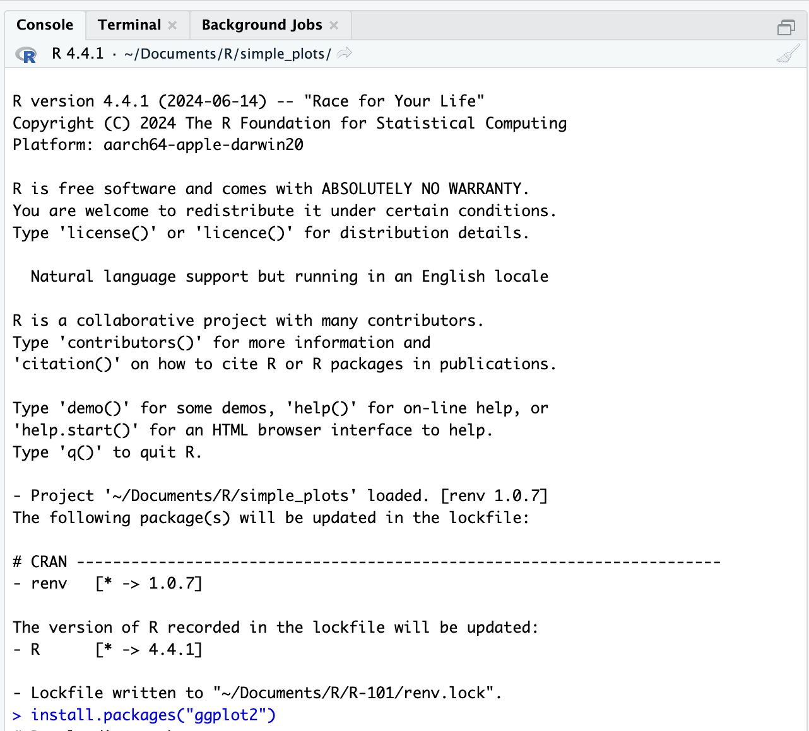 After a few
   seconds, you should see the code downloading and installing.
3. validate that the package has been installed Once the package is installed,
   you can load it into your R session using the `library()` function. To load
   the `ggplot2` package, run the following code in the console:
   ```R
   library(ggplot2)
   ```
   If you run this code in the console and don't receive any errors, you know
   that the package has been loaded successfully, and the library is has been
   loaded into your R session.
4. Update the `renv.lock` file. "Snapshotting" ensures that the `renv.lock` file
   is updated with the packages you have installed. This file is used to
   recreate the environment on another machine. By default, this uses `static`
   snapshotting, which means that only the packages you have installed are
   included in the lockfile. This might mean that some packages are not included
   in the lockfile, which can cause issues when trying to recreate the
   environment on another machine. To avoid this, you can use `all`
   snapshotting, which includes all the packages in the lockfile, even if they
   are not used in your project. To update the `renv.lock` file, run the
   following code in the console:
   ```R
   renv::settings$snapshot.type("all")
   ```
5. Update the `renv.lock` file. To update the `renv.lock` file, run the
   following code in the console:
   ```R
   renv::snapshot()
   ```
6. check the `renv.lock` file. To check the `renv.lock` file, run the following
   code in the console:
   ```R
   renv::status()
   ```
   We can also look at the contents of the `renv.lock` file by running the
   following code in the console:
   ```R
   readLines("renv.lock")
   ```
   or more simply, open the file in the Files pane.
   
7. Create a simple plot. To create a simple plot, run the following code in the
   console:
   ```R
   ggplot(data = mtcars, aes(x = mpg, y = hp)) + geom_point()
   ```
   this code calls the `ggplot()` function from the `ggplot2` library we loaded
   in step 3. The `ggplot()` function creates a new plot, and the `geom_point()`
   function adds points to the plot. The `aes()` function is used to specify the
   aesthetics of the plot. This should create a plot that looks like this:
   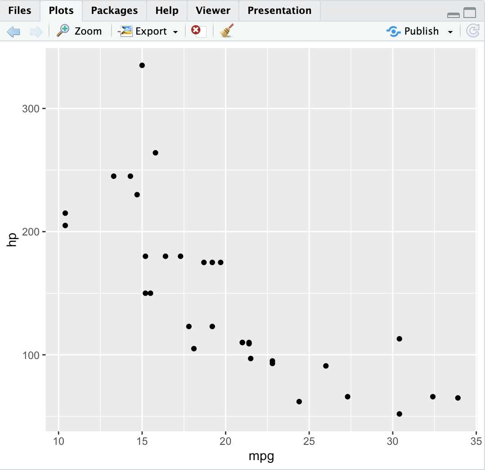

If you see a plot like this, you have successfully installed R and RStudio and
created a simple plot using the `ggplot2` package. You are now ready to start
exploring the world of data visualisation in R.

## Activity 10.0.3

_Allow 20 minutes for this activity_

> Where did the data for our test plot come from? What does the plot show?

### Discussion

R comes with many in-built datasets that you can use to test your code. You can
find the datasets available by running this in your console:

```R
library(help='datasets')
```

The `mtcars` dataset is described as "Motor Trend Car Road Tests". It contains
data on various car models, including miles per gallon (mpg), horsepower (hp),
and other variables. The plot we created shows the relationship between miles
per gallon and horsepower for each car in the dataset. We can see that there is
a negative correlation between miles per gallon and horsepower, which means that
cars with higher horsepower tend to have lower miles per gallon.

We can look at the first few rows of the `mtcars` dataset by running the
following code in the console:

```R
head(mtcars)
```

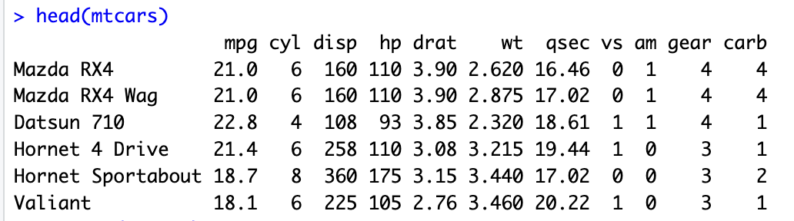

`head()` is a function that returns the first few rows of a dataset. There is
also a `tail()` function that returns the last few rows of a dataset.

or get a statistical summary of the dataset by running the following code in the
console:

```R
summary(mtcars)
```

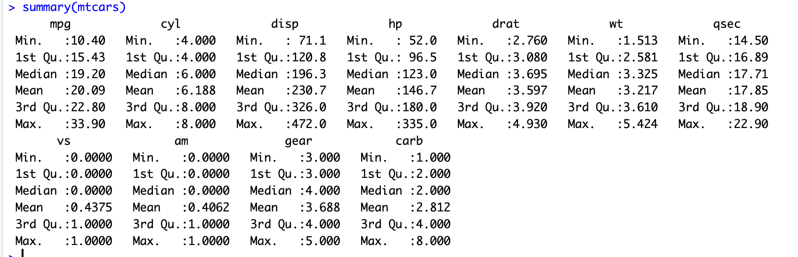

We can get the shape (or _dimension_) of the dataset by running the following
code in the console:

```R
dim(mtcars)
```

## Using Notebooks

Now we have our project set up, we can start writing some code. RStudio has an
inbuilt notebook feature that allows you to create R Notebooks. Notebooks
typically contain a mix of code, text, and visualisations. They allow you to
explain your code and results in a single document. To create a new R Notebook,
click on the new file icon in the top left corner, and choose `R Markdown`. You
may be prompted to install some packages the first time you create a new
notebook. Once you have installed the required packages, you will be presented
with a new notebook that looks like this:

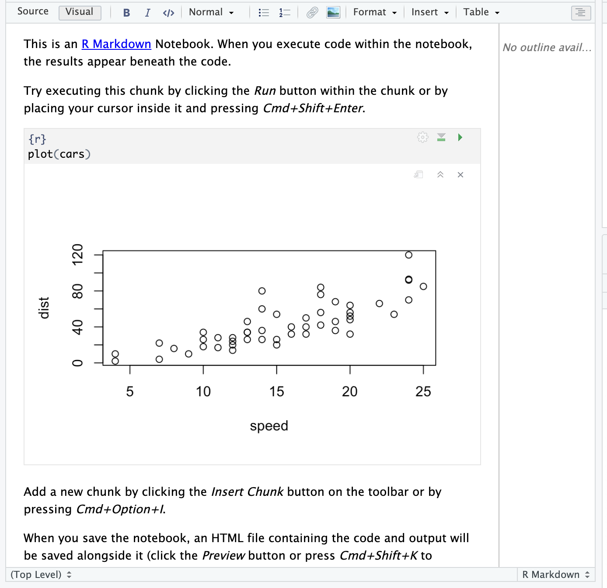

### Components of a Notebook

Let's break down the components of a the notebook we just created:

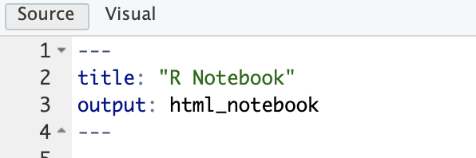

The first four lines are a `YAML` block. `YAML` ("Yet Another Markup Language",
or "YAML Ain't Markup Language") is a way of setting and defining parameters.
The three hyphens at the start and end of the block are used to denote the start
and end of the `YAML` block. In this case, we are setting the variable `title`
to "R Notebook" and the `output` to `html_document`. YAML has the format of
`key: value`. If the value is a string with spaces, it should be enclosed in
quotes.

```YAML
---
title: "R Notebook"
output: html_document
---
```

At present, this YAML block sets the title of the notebook and the output
format. The `output` field can be set to `html_document` or `pdf_document`. If
we `knit` the notebook, it will be rendered in the format specified in the
`output` field.

We could easily extend this to include other parameters, such as the author of
the notebook, the date it was created, or some other important information.

```YAML
---
title: "R Notebook"
author: "Your Name"
date: 2024-10-01
output: html_document
---
```

### Text Blocks

The next lines in the notebook are a text block. Text blocks are used to add
text to the notebook. You can use text blocks to explain your code, describe
your results, or provide any other information you think is relevant.

```markdown
This is an [R Markdown](http://rmarkdown.rstudio.com) Notebook. When you execute
code within the notebook, the results appear beneath the code.

Try executing this chunk by clicking the _Run_ button within the chunk or by
placing your cursor inside it and pressing _Cmd+Shift+Enter_.
```

If we switch to the "visual" tab, we can see that the text is rendered as a
paragraph.

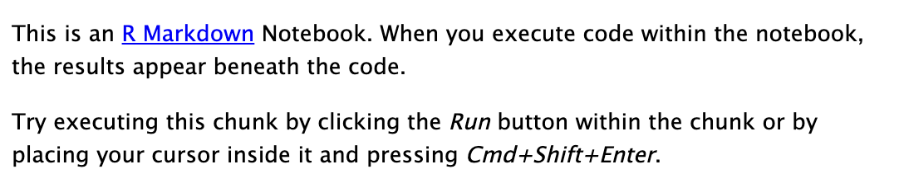

The text is formatted using a simple markup language called `Markdown`. This is
an exceptionally useful language to learn; it is widely used in data science,
programming, wikis, and many other areas. Like SQL there are many dialects of
Markdown, but the basic principles are the same. There is an excellent overview
of the general syntax at
[Markdown Guide](https://www.markdownguide.org/basic-syntax/), and a R specific
guide at [R Markdown](https://rmarkdown.rstudio.com/authoring_basics.html).

### Code Blocks

a code block is defined by a "code fence" which is three backticks. The code
block is then defined by the language of the code. In this case, it is R.

````markdown
```{r}
plot(cars)
```
````

You'll see that the code block is shaded in a different colour to the text
block. This makes it easier to see where the code starts and ends. the lock also
has some icons on the right hand side. These are used to modify the code block
behaviour, run all the subsequent code blocks, or run the current code block.
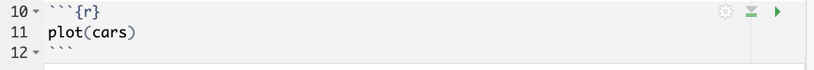

If we press the "Run" button, the code block will be executed, and the output
will be displayed below the code block.
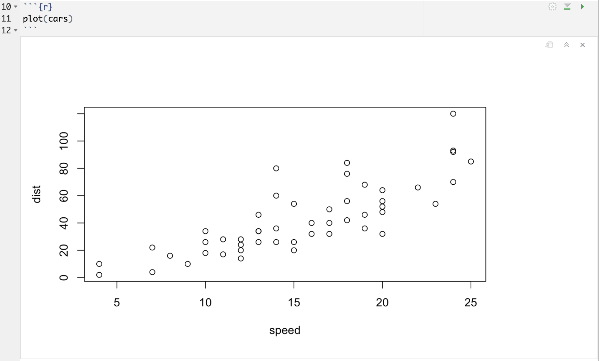

We can add comments to our code blocks by using the `#` character. Comments are
ignored by the R interpreter, so they are a good way to add notes to your code,
this is particularly important if you are using an unconventional method or if
you are doing something that is not immediately obvious.

```R
# This is a comment
plot(cars)
```

## Activity 10.0.4

_Allow 20 minutes for this activity_

Create a new R Notebook in your project and write some code to create a plot.
You can use the code from the previous activity to create a plot of miles per
gallon against weight (`wt`). Add some text to explain what the plot shows.

1. Create a new R Notebook in your project. To create a new R Notebook, click on
   new file icon in the top left corner, and choose `R Notebook`.
   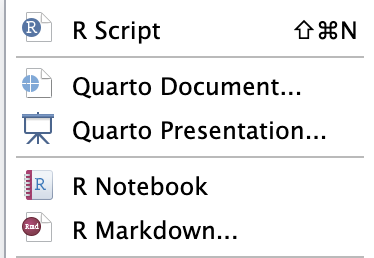 You may be
   prompted to install some packages the first time you create a new notebook.
   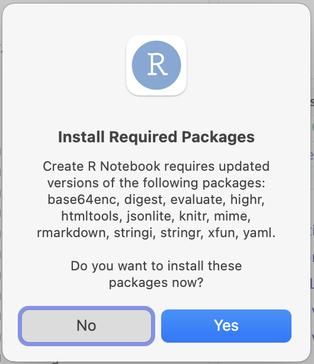
   If you are prompted to install packages, click `Install` to install the
   required packages. Now would be a good time to snapshot your environment
   using `renv` to ensure that the packages you have installed are included in
   the `renv.lock` file.
   ```R
   renv::snapshot()
   ```
2. Write some code to create a plot. You can use the code from the previous
   activity You should be presented with a a default notebook that looks like
   the previous image. We'll need to add some code to create a plot. You can use
   the code from the previous example to create a plot of miles per gallon
   against horsepower. Add some text to explain what the plot shows.

### Discussion

My notebook is available in [Activities](../Activities/10/10.0.4/). Try
running it in your RStudio environment. What do you think of the plot? What does
it show? How could you improve it?

## Loading data

So far, we have been using in-built datasets to create our plots. Although this
is useful to demonstrate the capabilities of R, we need to analyse our own data.
In this section, we will look at how to load data into R.

| Format | load function          |
| ------ | ---------------------- |
| CSV    | `read.csv()`           |
| Excel  | `read_excel()`         |
| JSON   | `jsonlite::fromJSON()` |
| RData  | `load()`               |
| RDS    | `readRDS()`            |
| SQL    | `DBI::dbConnect()`     |
| XML    | `xml2::read_xml()`     |

You'll notice some unfamiliar formats: `Rdata` and `rds`. These are R specific
formats that are used to save data in R. `Rdata` files are used to save multiple
objects in a single file, while `rds` files are used to save a single object. If
you are working on complex projects with multiple datasets, you may find it
useful to save your data in `Rdata` format. If you are working on a single
dataset, you may find it easier to save your data in `rds` format.

You'll notice that the functions to load `json`, `sql`, and `xml` files have a
slightly different syntax. This is because they are part of a package that is
not loaded by default. Depending on the package, you may need to install it
before you can use it. You can install a package using the `renv::install()` or
`install.packages()` function. Once the library is installed, you can load it
using the `library()` function.

## Activity 10.0.5

_Allow 30 minutes_

There is a RMarkdown notebook in [Activities](../Activities/10/10.0.5/) that
contains some code to load various file formats. Try running the code in your
RStudio environment. If you have your own data, try adapting the code to load
your data.

## Saving data

Once you have loaded your data, you may want to save it in a format that is
easier to share. R has functions to save data in various formats. The most
common formats are:

| Format | save function         |
| ------ | --------------------- |
| CSV    | `write.csv()`         |
| Excel  | `write_xlsx()`        |
| JSON   | `jsonlite::toJSON()`  |
| RData  | `save()`              |
| RDS    | `saveRDS()`           |
| SQL    | `DBI::dbWriteTable()` |
| XML    | `xml::write_xml()`    |

## Activity 10.0.6

_Allow 30 minutes_

There is a RMarkdown notebook in [Activities](../Activities/10/10.0.6/) that
contains some code to save various file formats. Try running the code in your
RStudio environment. If you have your own data, try adapting the code to save
your data.

---

https://learnr.numbat.space/

<!-- TODO: Add second section: using R -->
