# Python

Python is also a versatile language that can be used for a wide range of tasks,
from web development to scientific computing. Although it is a general purpose
programming language, it has a number of features that make it particularly
well-suited to data science tasks. These include:

- **Ease of use**: Python is known for its simplicity and readability. This
  makes it easy to learn and use, even for beginners.
- **Extensive libraries**: Python has a large number of libraries that are
  specifically designed for data science tasks. Some of the most popular
  libraries include `pandas`, `numpy`, and `scikit-learn`.
- **Community support**: Python has a large and active community of developers.
  This means that there are plenty of resources available to help you learn and
  use the language.
- **integration with other languages**: Python can be easily integrated with
  other languages such as C, C++, and Java. Python also has hooks into operating
  system calls, databases, and other low-level constructs. This means it is
  possible to construct a complete data science pipeline in Python.

## Installing Python

It is likely that you may already have Python installed on your computer. In
practice, it is better to have a separate installation of Python for data
science tasks. This is because the libraries that are used in data science can
sometimes conflict with other libraries that you may have installed.  Moreover, Some operating systems disable the ability to add libraries to the system Python installation, so you may be unable to perform anything other than basic tasks with the system Python installation.

You may also find that the version of Python already installed on your computer is an older version which may be missing features or security updates.

### Installing Python as a standalone

Although Anaconda and Miniconda offer an easy way to get up and running with
Python, you may prefer to install Python as a standalone. This is slightly more
complex than using a distribution, but it gives you more control over the
installation process. Installing Python as a standalone is a good choice if you
are wanting to use Python for more general programming tasks, or if you are
already familiar with Python and want to set up a specific environment for data
science tasks.

Python can be downloaded from the
[Python website](https://www.python.org/downloads/). You may also find it in
your operating system's package manager:

| Operating System | Install command            |
| ---------------- | -------------------------- |
| Windows          | `winget install python`    |
| macOS            | `brew install python`      |
| Linux            | `sudo apt install python3` |

Using a package manager will help you to keep your installation up to date, and may help manage the $PATH variable.

If you are installing python as a standalone, you will find that multiple
versions are available. Any version from 3.9 onwards is suitable for data
science tasks. Earlier versions will either be deprecated, or will be missing
features or security updates. There is a page listing the
supported versions at the
[Python website](https://devguide.python.org/versions/). My recommendation is to
use Python3.12 as it has performance boosts, and has native support for `TOML` files, which will come in handy when you are working with configuration files.

Python 3.12 is an established and  stable
release. Later versions will have additional features, but you may find they have
not been made available in your package manager.  If you intend to share your code with others, you may may find that choosing a bleeding edge version may cause issues with compatibility.

Once you have installed Python, you can check that it is installed correctly by running the following command in your terminal:

```bash
python --version
```

If Python is installed correctly, you should see the version number displayed in the terminal.  If you see an error message, or a different version number, you may need to check your installation.  Some package managers will install Python as `python3`, so you may need to run `python3 --version`, or even `python3.12 --version` to check the version number.  If you are using a Windows machine, you may need to run `python.exe --version` to check the version number.  You can have multiple versions of python installed on your machine, so you may need to check the version number of each one.

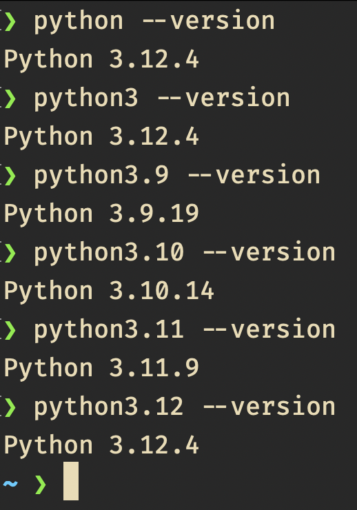

## Using Python for Data Science

Now we have Python installed, we can start using it for data science tasks.  The next few blocks will cover the basic tasks of creating a reproducible environment, and installing the libraries that are commonly used in data science tasks.  This is somewhat more involved that the process in Anaconda, but once you learn the syntax, the steps can be achieved in a couple of minutes, or scripted to run automatically.

## Activity 10.0.1: Create a Virtual Environment 

Irrespective of the tools we use, we should always aim to make our work reproducible.  Not only does this make sharing our work easier, it gives us a way to return to a known state if we make a mistake.  One way to do this is to create a virtual environment.  

One way to do this is to create a virtual environment.  A virtual environment is a self-contained directory that contains a Python installation for a particular version of Python, plus a number of additional packages. R has an equivalent concept with its `renv` package.  Because virtual environments are self-contained, we can have multiple projects on the go, each with a different version of Python, or different libraries installed, safe in the knowledge that they will not interfere with each other.  

In your command prompt, navigate to the directory where you want to create your virtual environment.  You can create a virtual environment by running the following command:

```bash
python -m venv <the name of your environment>
```


This command calls `python` and uses the module (`-m`) `venv` to create a virtual environment with thename you supplied.  If the version of python you installed earlier has a different name, you may need to use that name instead of `python`.

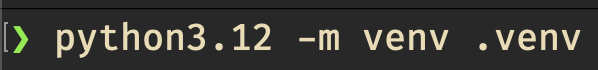
This was the case for me, I wanted to explicitly use Python3.12
I have named my virtual environment `.venv`.  This is a common name, and if you are using a Linux, or MacOS machine, the directory will be hidden by default, which will keep your working directory clean. You are free to name your virtual environment whatever you like, but it is good practice give it a short name without spaces.

Once you have created your virtual environment, you can activate it by running the following command:

```bash
source .venv/bin/activate
```
If you are using a Windows machine, you will need to run the following command in a powershell window:

```powershell
.venv\Scripts\Activate.ps1
```
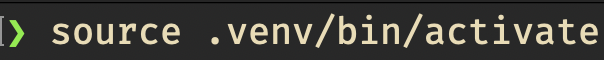


Now we are in our virtual environment, we can install the libraries that we need.  The libraries that we will be using are `pandas`, `numpy`, `matplotlib`  `jupyter`.  These libaries can be installed using `pip`, which is a package manager for Python.  The syntax for installing is `pip install <library name>`.  We could install each library individually, but it is more common to install them all at once.  We can do this by running the following command:

```bash
pip install pandas numpy matplotlib jupyter
```
This may take some time to complete, as the libraries are downloaded from the internet, and installed on your machine. Libraries such as jupyter can be large and complex, so may have dependencies that need to be installed first.  You may see a lot of output on your screen, but you can ignore this unless there are any errors.

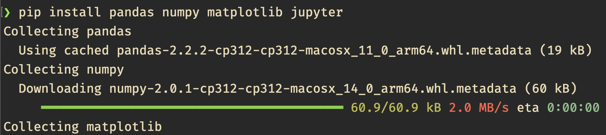

We installed five libraries, let's validate they are in our virtual environment. we can doe this using pip's `list` command.  This will list all the libraries that are installed in the virtual environment.  Run the following command:

```bash
pip list
```

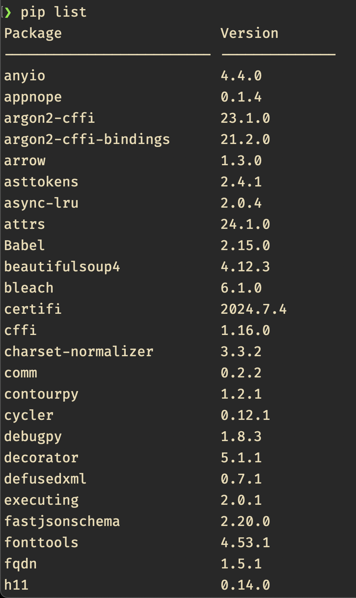

You should see that the libraries we requested have been installed, alonside a number of other libraries that are required for the libraries we installed.

A second use of `pip list` is to create a `requirements.txt` file.  This file lists all the libraries that are installed in the virtual environment, and their versions.  This is useful if you want to share your work with others, or if you want to recreate the environment at a later date.  You can create a `requirements.txt` file by running the following command:

```bash
pip freeze > requirements.txt
```

we should see that a file called `requirements.txt` has been created in our working directory.

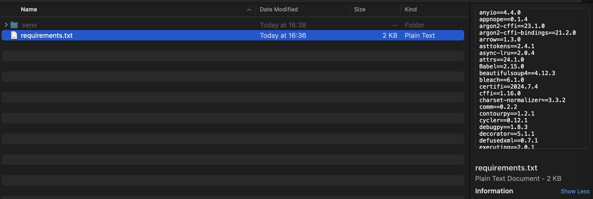
If we open this file, we will see a list of all the libraries that are installed in our virtual environment, and their versions.

## Activity 10.0.2: Start a Jupyter Notebook

Jupyter notebooks are a powerful tool for data science tasks.  They allow you to write and run code in a web browser, and to include text, images, and other media in the same document.  This makes them ideal for sharing your work with others, or for documenting your work.  Jupyter notebooks are also interactive, which means you can run code in a cell, and see the output immediately.  This makes them ideal for exploring data, or for prototyping code.

To start a Jupyter notebook, you can run the following command in your terminal:

```bash
jupyter notebook
```

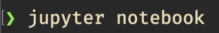

After a few seconds, your web browser should open, and you should see the Jupyter notebook interface.

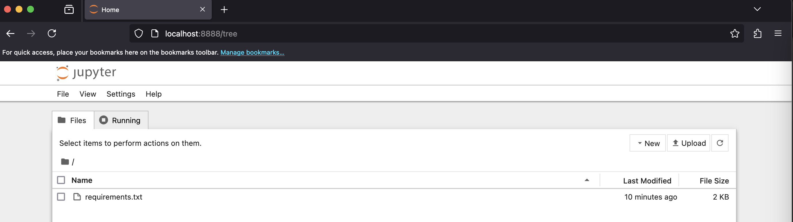

Behind the scenes, Jupyter is running a web server on your computer.  This server is serving the Jupyter notebook interface to your web browser.  You can interact with the interface in the same way you would interact with a web page.  You can create new notebooks, open existing notebooks, and run code in the cells.

## Activity 10.0.3: Create a new Jupyter Notebook

Creating a notebook is as simple as clicking the "New" button in the top right of the interface, and selecting "Notebook" from the dropdown menu.
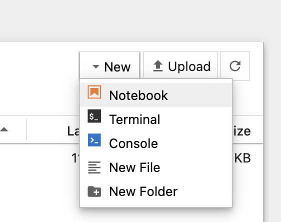

A new tab should open in your browser, and you should see a blank notebook.  You will be prompted to choose a kernel for your notebook.  A kernel is a program that runs your code.  Because we are running the notebook in a virtual environment, we can accept the default kernel, which is the kernel that is running in the virtual environment.

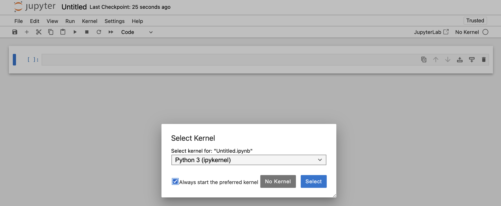

Before we do anything else, let's give our notebook a name.  Click on the text "Untitled" at the top of the notebook, and type a name for your notebook.  I have named my notebook "My\_First\_Notebook".
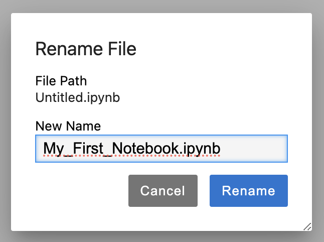


```bash
deactivate
```
