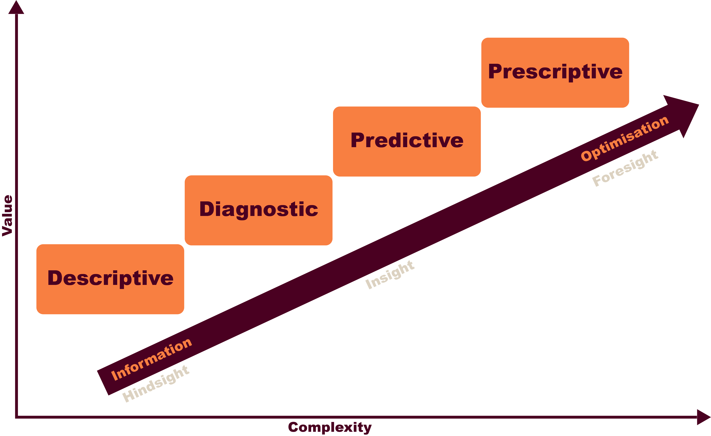
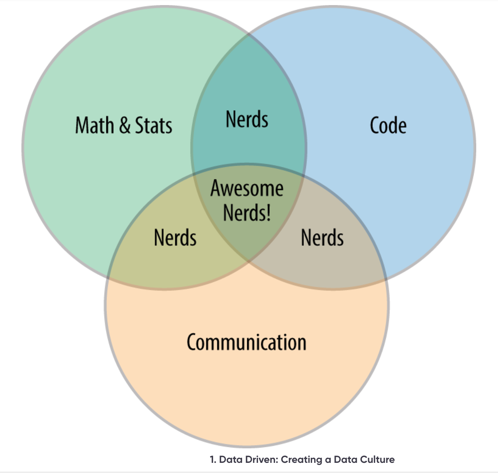
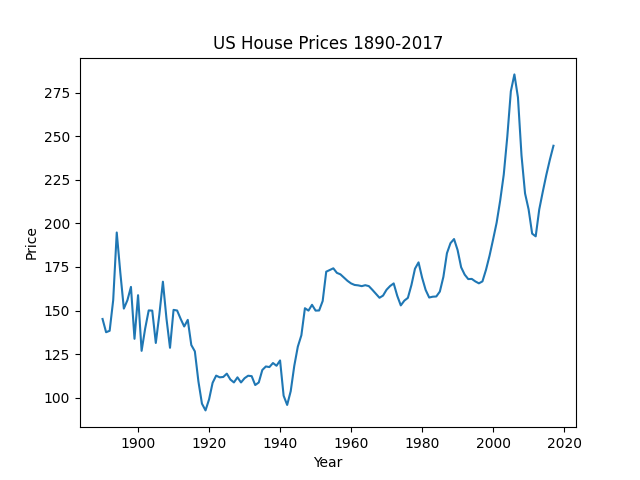
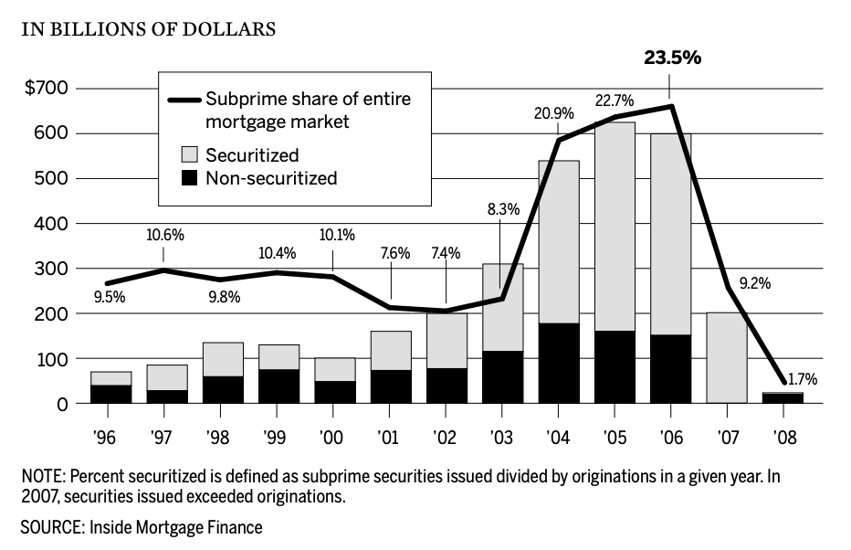

# Week 1: Introduction

### First Things First

> Look at the module guide and the assessment briefs. Make sure you understand
> what is expected of you and what you need to do to pass the module. Make sure
> you understand the deadlines and the assessment criteria. Whilst the
> terminology may be unfamiliar at this stage, it should give you an
> understanding of what is required, when. If you have any questions, let your
> tutor know. It is a good idea to get the deadlines in your calendar now, so
> you can plan your time effectively.

---

Data Science is the study of data to find insights and trends. It is a
multidisciplinary field that uses techniques from statistics, machine learning,
and computer science to analyse and interpret complex data. Data visualisation
is the process of presenting data in a visual format, such as charts, graphs,
and maps, to help people understand the data and make informed decisions.

In this course we will explore the key concepts and techniques of data science
and data visualisation, and learn how to apply them to real-world problems. We
will cover topics such as data cleaning, data wrangling, data analysis, and data
visualisation. The course purposefully doesn't focus on specific tools or
programming languages, but rather on the underlying concepts and techniques that
are common to all data science and data visualisation projects. As a data
scientist, you may not have free-choice of tools, so it is important to
understand the underlying principles and techniques that are common to all data
science projects.

## What Is Data Science?

Data Science is an essential part tool in the modern economy. It underpins the
AI revolution and is used in a wide range of industries, from finance to
healthcare to marketing. Data Science underpins our ability to:

1. Understand our customers better
2. Make informed decisions
3. develop new products and services

==Expand with examples==

==quote from Data Now/ doughnut economics/ Big data now==

Though you may associate Data Science with big tech companies or finance, it is
increasingly essential to a broad range of industries. Universities will use
data science to track and understand student performance to improve teaching and
support. Healthcare providers use data science to improve patient outcomes.
Governments use data science to improve public services. Data science is
_everywhere_.

### Types of Data Science

Data Science can be divided into four main areas. These areas are not mutually
exclusive, and many data scientists will work across multiple areas.

#### Descriptive Analytics

Descriptive analytics uses data to describe _what_ has happened in the past. For
example, a company might use descriptive analytics to analyze sales data to
understand trends and patterns. You'll try your hand at descriptive analytics
later in this week.

#### Diagnostic Analytics

Diagnostic analytics uses data to understand _why_ something happened. For
example, a company might use diagnostic analytics to analyze customer feedback
to understand why sales have dropped. You'll try your hand at diagnostic
analytics later in this course.

#### Predictive Analytics

Predictive analytics uses historical data to predict _how_ likely something is
to happen in the future. For example, a company might use predictive analytics
to forecast sales or customer churn.

#### Prescriptive Analytics

Prescriptive analytics uses data to recommend actions to achieve a desired
outcome. For example, a company might use prescriptive analytics to optimise its
supply chain or marketing strategy.

### What is a Data Scientist?

Image courtesy of @patilDataDriven2015 [p. 3]

### Case Study: The Housing Market Crash of 2008

In 2008, the housing market crash triggered a global financial crisis that led
to the worst recession since the Great Depression. It has been depicted in films
such as The Big Short and Inside Job. This crash

This housing market crash wasn't caused by a single factor, but rather a
combination of interconnected issues:

#### Housing Bubble

Easy access to credit and low interest rates inflated housing prices beyond
their true value, creating a bubble. The American hosing market had
traditionally been stable. Nate Silver reports that

> "After adjusting for inflation a $10,000 investment in a home in 1896 would be
> worth just $10,600 in 1996. The rate of return had been less in a century than
> the stock market typically produces in a year."

@silverSignalNoiseArt2013 [p. 30]

You can see the relative US house prices in the graph below. Note the sharp
increase in house prices starting in 2003, and the subsequent crash in 2008.

#### Activity: recreate this graph

There is a simple dataset
[here](https://www.multpl.com/case-shiller-home-price-index-inflation-adjusted/table/by-month)
that you can use to recreate this graph. I've created an `csv` (Comma Separated
Values) file of the data in [activities](Activities/1/houseprices.csv) You can
use Excel, Google Sheets, or any other tool you are comfortable with.

##### Discussion

==This'll be a half-hour minute "how I did it" session==

#### Subprime Mortgages

Lenders offered risky loans to borrowers with poor credit history (subprime) at
adjustable interest rates. These borrowers struggled to afford payments when
rates went up. In the space of just three years, the share of the market for
subprime mortgages had grown from 8.3% of the market to 23.5% of the market.
This near-tripling of the market share meant that almost a quarter of mortgages
were at active risk of default.

Image courtesy of @thefinancialcrisisinquirycommissionFINANCIALCRISISINQUIRY2011 [p. 70]

##### Extend your learning

There is an excellent, albeit very technical explanation of the subprime
mortgage crisis
[here](https://www.nber.org/system/files/working_papers/w14625/w14625.pdf)
Whilst the technicalities are beyond the scope of this course, it will give a
great insight into the rigour of the analysis that data scientists and
economists undertake.

#### Mortgage-Backed Securities

One of the underlying reasons these risky mortgages were able to be offered was
the development of new financial products. Financial institutions such as Lehman
Brothers and Bear Stearns had developed new financial products that allowed them
to bundle these risky mortgages together and sell them as investments. These
Mortgage-Backed Securities (MBS) were sold to investors, spreading the risk but
also making it hard to assess the underlying quality of the loans. Each Mortgage
Backed Security is essentially a bet that the underlying mortgages will be
repaid. These bets were then bundled together and sold on to other investors.
This meant that the risk was spread across the financial system, but also meant
that it was hard to assess the underlying quality of the loans. Lehman Brothers
effectively bet thirty one times _on each mortgage_ being repaid
[@lioudisCollapseLehmanBrothers2024]. When the housing market crashed, the value of these
Mortgage Backed Securities plummeted, and financial institutions buckled under
the weight of bad debt. This triggered a domino effect that led to the global
financial crisis.

#### Predatory Lending

These MBS were a primary contributing factor to the increase in predatory
lending practices. Loan providers knew that they could sell on the risk, so they
were less concerned about the underlying quality of the loans. Alongside this,
mortgage brokers were incentivised to sell as many loans as possible, as they
received a commission for each loan they sold. Silver reports that ===what===
Unethical lending practices included misleading borrowers about loan terms and
inflating their income to qualify for loans. This meant that they could offer
loans to people who were unlikely to be able to repay them. This also had the
effect of accelerating the housing bubble; borrowers who were previously unable
to afford properties were now able to buy them, which in turn accelerated the
rise in house prices.

#### Lax Regulation

Underlying all of these issues was a lack of regulation. The US government had
deregulated the financial sector in the 1980s and 1990s, which allowed financial
institutions to take on more risk. The government also failed to regulate the
mortgage industry, which allowed predatory lending practices to flourish. The
government also failed to regulate the financial products that were being
developed, which allowed the creation of complex financial products that were
difficult to understand and assess. Compounding this was the fact that salaries
at credit agencies were a third of those at investment banks, meaning that the
best talent ended up working for the banks, rather than the credit agencies. The
gamekeeper was effectively working for the poacher.

These factors all came together to create a ticking time bomb. When the housing
bubble burst, homeowners defaulted on their mortgages, the value of MBS
plummeted, and financial institutions buckled under the weight of bad debt. This
triggered a domino effect that led to the global financial crisis.

#### Could Data Science Have Prevented the 2008 Financial Crisis?

The underlying causes of the 2008 financial crisis were complex, and it was only
after the fact that the pieces of the puzzle came together. ===BULK THIS OUT
with examples===

Despite the complexity of the contributing factors and the hidden risks, data
science could have helped identify the warning signs of the impending crisis.
Here's how:

#### Now do this

Use the library search to find out more about the housing crisis. You could
start with the following search terms:

- Housing crisis 2008
- Subprime mortgages
- Mortgage-backed securities
- Predatory lending
- Lax regulation

### Asking the right questions

Not all problems are as complex as the 2008 financial crisis. ===BULK THIS
OUT=== A good place to start with data science is understanding what problem you
are trying to solve or interrogate.

Gutman and Goldmeier (2021, p4) suggest that the first step in any data science
project is to define the problem you are trying to solve. They introduce a
series of questions that can help you define the problem:

1. Why is this problem important?
2. Who does this problem affect?
3. What if we don’t have the right data?
4. When is the project over?
5. What if we don’t like the results?

### Now read this:

Becoming a Data Head - How to Think, Speak, and Understand Data Science,
Statistics, and Machine Learning Chapter 1

### Activity 1.2

> Are there any other questions you should consider when defining a data science
> problem?

#### Discussion

Whilst the questions above are a good starting point, there are many other
questions you could consider when defining a data science problem. For example,
you could consider the following questions:

##### Do I have enough data to draw robust conclusions?

Whilst there are vast datasets available, it is important to consider whether
you have enough data to draw robust conclusions. If you are working with a small
dataset, you may need to consider whether you need to collect more data or
whether you can draw robust conclusions from the data you have.

##### What are the limitations of the data?

It is important to consider the limitations of the data you are working with.
For example, you may need to consider whether the data is representative of the
population you are interested in, whether the data is accurate, and whether the
data is up-to-date.

##### Do I need to aggregate the data in some way?

Online datasets are often purposefully aggregated to protect privacy. You should
consider whether the the problem you are trying to solve needs de-aggregated
data. If it does, perhaps you need to collect your own data, or aggregate
multiple datasets.

##### What is the quality of the data?

Often, raw data is messy and needs to be cleaned before it can be analysed. You
should consider whether the data you are working with is clean, or whether you
need to clean it before you can analyze it.
